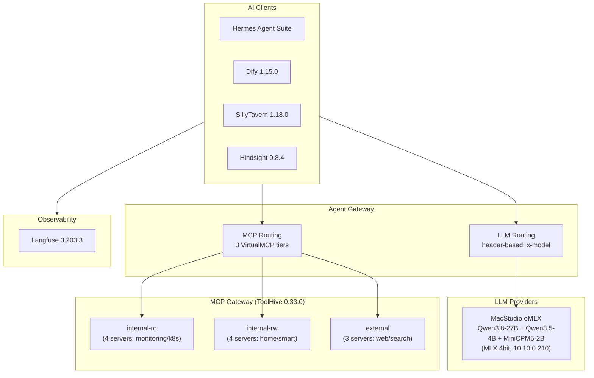

# AI Infrastructure Summary
Last updated: 2026-09-09

Source: Flux manifests in `kubernetes/apps/`.

## Architecture Overview



## Agent Gateway — Central LLM + MCP Router

The agent gateway is the single entry point for all AI traffic. Every AI app routes through it — no app talks to an LLM or MCP server directly.

### LLM Backends (header-based routing on `/chat`)

| Route Header                             | Backend               | Model                              | Provider            |
| ---------------------------------------- | --------------------- | ---------------------------------- | ------------------- |
| `x-model: complex` or `x-priority: high` | `llm-backend-complex` | `qwen3.8-27b`                      | **Local** MacStudio        |
| `x-model: fast`                          | `llm-backend-fast`    | `qwen3.5-4b`                       | **Local** MacStudio        |
| `x-model: memory`                        | `llm-backend-memory`  | `qwen3.5-4b`                       | **Local** MacStudio |
| `x-model: vision`                        | `llm-backend-vision`  | `qwen3.5-4b` (vision-capable)      | **Local** MacStudio |
| `x-model: micro`                         | `llm-backend-micro`   | `minicpm5-2b`                      | **Local** MacStudio |

All backends speak OpenAI-compatible API. Auth via ExternalSecret-managed API keys. Every lane now runs on the MacStudio inference host (`studio.homelab.internal`, 10.10.0.210, oMLX OpenAI-compatible endpoint) — no external LLM API dependency remains. `complex`/`x-priority: high` uses Qwen3.8-27B; `fast`/`memory`/`vision` use Qwen3.5-4B (a unified vision-language model, one endpoint serves all three lanes). No cloud fallback is configured — the studio is a deliberate SPOF.


Lane-fit guidance (from MiniCPM5-2B benchmarks: strong classification/agentic-at-size, weak long-context/knowledge, abstains under uncertainty): `micro` fits classification, tagging, title/routing decisions, short structured extraction. Keep `fast` for summarization, compression, session search, memory writes (fidelity-sensitive; MiniCPM5-2B's long-context recall AA-LCR 59% and abstention bias make it unsafe for memory extraction). `vision` is never a `micro` candidate — MiniCPM5-2B is text-only.

`micro` uses **MiniCPM5-2B** (Apache-2.0, 2.6B dense, official 4-bit MLX port `openbmb/MiniCPM5-2B-MLX`, ~1.4 GB resident on the studio) for cheap, low-latency work: classification, extraction, tagging, short summaries, and as the classifier for semantic routing. Serve it with thinking disabled (`chat_template_kwargs: {"enable_thinking": false}`) and constrained JSON output for label safety. The oMLX model alias on the studio must be `minicpm5-2b` (host-side config, out-of-band).

### Intranet exposure

The gateway API surface is exposed to the intranet via `kgateway-internal` (10.10.0.131) at `https://api.noirprime.com` (`/chat`, `/mcp`, `/v1/*` media; dashboard stays on `https://ai.noirprime.com/ui`):

- `/chat` — LLM routing (strict API key, 300s timeout, promptGuard guardrails)
- `/mcp` — MCP tool routing (strict API key, backend guardrails)
- `/v1/images`, `/v1/audio`, `/v1/embeddings`, `/v1/rerank` — media passthrough to studio (strict API key, no LLM parsing)
  (dashboard UI lives separately at `https://ai.noirprime.com/ui`)

TLS terminates at kgateway (cert-manager `noirprime-com-tls`, wildcard `*.noirprime.com`); external-dns auto-creates the AdGuardHome record. Machine clients authenticate with agentgateway API keys — no SSO extAuth on API paths. Reachable from trusted VLANs (10/100/200); IoT VLAN 210 is ACL-blocked from RFC1918.

### App → model lane

| App                  | Lane              | Model              | Notes                                                        |
| -------------------- | ----------------- | ------------------ | ------------------------------------------------------------ |
| hermes-agent         | `complex`         | Qwen3.8-27B        | Agentic reasoning / KB QA / automation; set via 1Password (out-of-band) |
| hindsight            | `memory`          | Qwen3.5-4B         | Extraction-dominant (single-model constraint); embeddings + reranker via gateway media routes |
| firecrawl            | `fast`            | Qwen3.5-4B         | Batch page extraction/summarization                          |
| karakeep             | `fast` + `vision` | Qwen3.5-4B         | Text + image tagging                                         |
| home-assistant-sgcc  | `vision`          | Qwen3.5-4B         | Meter/bill photo OCR                                         |
| SillyTavern          | UI-configured     | Gemma4-31B lane    | Creative/RP; no repo-level config                            |
| open-notebook        | UI-configured     | suggest `complex`  | Research synthesis; no repo-level config                     |
| onyx                 | UI-configured     | suggest `micro`/`fast` | Chat/RAG; LLM provider set in admin UI (api_base → agentgateway) |

### MCP Backend

Routes to 3 **ToolHive VirtualMCP servers** (`StreamableHTTP` on port 8080):

- `vmcp-internal-ro` — read-only monitoring/k8s tools
- `vmcp-internal-rw` — read-write home/smart tools
- `vmcp-external` — external web/search tools

---

## LLM Inference — Local

All local lanes (`fast`/`memory`/`vision`) run on the MacStudio inference host. The in-cluster llama.cpp deployment (`llama-qwen3`) was archived 2026-08-28 (`.archived/kubernetes/servitor/llama`); its 50Gi CephFS PVC `llama` is retained for manual cleanup.

---

## AI Agent Platform

### Hermes Agent Suite

| Component | Port | Notes                       |
| --------- | ---- | --------------------------- |
| Dashboard | 9119 | SSO-protected               |
| Gateway   | 8642 | Internal, health: `/health` |
| Web UI    | 8787 | SSO-protected               |

- **Runtime**: Kata Containers (VM isolation)
- **Resources**: req: 200m CPU / 1Gi RAM, lim: 4Gi RAM
- **Integrations**: WeChat, Firecrawl (internal), ToolHive MCP, Agent Gateway LLM
- **Egress**: CiliumNetworkPolicy — only agentgateway-proxy, virtualmcp, kube-dns
- **Depends on**: `agentgateway` (Flux dependency)
- **Profiles** (seeded declaratively by the `seed-config` initContainer from `configmap.yaml`; dashboard edits to `config.yaml`/profile files revert on restart):
  - `ops` — the batching brain: existing cron/WeChat/automation workload migrates here via the dashboard (runtime state move; read-only-first posture, ToolHive tiers as today)
  - `chat` — chat-like frontends (Onyx and similar): isolated memory + config, own `API_SERVER_KEY` (scoped secret, 1Password `chat_api_server_key`); multiplexed gateway serves it at `:8642/p/chat/v1` with served model id `chat` (per-profile model names are NOT supported under multiplexing — the id is the profile name); no `API_SERVER_KEY` is seeded for `ops`, so `/p/ops/` fails closed
  - `default` — left untouched as fallback/scratch
  Model/provider config (`model.provider: custom` → agent gateway, `model.default: complex`) and aux side-tasks (`vision`/`web_extract`/`title_generation`/`session_search`/`compression` → `vision`/`fast`/`micro` lanes) are GitOps-managed in `configmap.yaml`; the gateway's PreRouting transformation maps body `model` → `x-model` header, so lane names are model names. Requires new 1Password `hermes-agent` fields: `api_server_key`, `chat_api_server_key` (both >=16 chars)
  Rationale: profile isolation keeps interactive-chat memory out of the automation brain (and vice versa) without a second deployment; graduate to a separate write-enabled instance only if interactive chat needs `internal-rw` tools

---

## LLM Application Platform

### Dify 1.15.0

| Component     | Image                                       | Resources                    |
| ------------- | ------------------------------------------- | ---------------------------- |
| api           | `langgenius/dify-api:1.15.0`                | req: 100m / 512Mi, lim: 1Gi  |
| web           | `langgenius/dify-web:1.15.0`                | req: 20m, lim: 256Mi         |
| worker        | `langgenius/dify-api:1.15.0`                | req: 200m / 1Gi, lim: 2Gi    |
| beat          | `langgenius/dify-api:1.15.0`                | req: 10m / 128Mi, lim: 256Mi |
| sandbox       | `langgenius/dify-sandbox:0.2.15`            | req: 20m, lim: 1Gi (Kata)    |
| proxy         | `ubuntu/squid:5.2-22.04_beta`               | req: 20m, lim: 256Mi         |
| plugin-daemon | `langgenius/dify-plugin-daemon:0.6.3-local` | req: 20m, lim: 1Gi           |

- **Backends**: CloudNativePG (PGVector), Dragonfly Redis (DB 0/1/2), Ceph S3
- **Sandbox**: Kata Containers, max_workers=4, routes egress through squid proxy
- **Model providers**: Configured at runtime via Dify admin UI, not in manifests
- **Depends on**: proxy → database → sandbox → api → (worker, beat, web)

### Onyx v4.7.1

- Chat + RAG enterprise search (replaces open-webui), chart 0.8.21 from `oci://ghcr.io/onyx-dot-app/charts/onyx`
- Components: api-server (:8080), webserver (:3000), inference + indexing model servers (CPU, nomic-embed-text-v1), 8 celery workers, bundled OpenSearch (single-node, 2Gi heap, 30Gi ceph-block)
- **Backends**: external CNPG (`postgres-rw.database-system`, DB bootstrapped by `onyx-postgres-init` Job), external Dragonfly (no auth), Ceph RGW bucket `onyx`; bundled Postgres/Redis-operator/MinIO/nginx subcharts all disabled
- LLM provider is DB-backed — configure once in Admin UI with `api_base` pointing at the agent gateway (`http://agentgateway-proxy.networking-system/chat`), suggested lane `micro`/`fast`; OIDC SSO likewise configured in Admin UI (forward-proxy SSO at kgateway also active)
- Ingress: `onyx.noirprime.com` via kgateway-internal; `/api|/openapi.json` regex → `onyx-api-service:8080`, `/` → `onyx-webserver:3000`, 900s timeouts
- **Craft sandboxes disabled** (no code-execution pods; `ENABLE_CRAFT` unset). If ever enabled, Craft runs code in dedicated pods in its own `onyx-sandboxes` namespace — never in hermes
- **Hermes as a model**: register the hermes gateway as an OpenAI-compatible provider with `api_base` = `http://hermes-agent.servitor-apps.svc.cluster.local:8642/p/chat/v1` and the profile's API key; the served model id is `chat` (profile name under multiplexing) — set Onyx **display name to `cluster`** in the provider's model configuration. Use it as the heavy/agentic chat model only — every call runs hermes' full agent loop (MCP tools, skills, memory), so it must never be selected for Onyx's auxiliary LLM calls (query rewrite, contextual RAG, summarization); those stay on `fast`/`micro`

### Media lanes (studio-hosted, OpenAI-compatible)

Non-chat modalities run as separate studio processes (oMLX has no image-gen; mlx-audio covers both audio types) and are exposed through the agent gateway as **plain HTTP passthrough** (no LLM parsing) on `agentgateway-media-route`, guarded by the same `llm-api-auth` API keys as `/chat`:

| Path             | Studio port | Server process     | Models                          | Timeout |
| ---------------- | ----------- | ------------------ | ------------------------------- | ------- |
| `/v1/images`     | 8001        | `vmlx serve` (mflux) | Z-Image-Turbo (6B)            | 300s    |
| `/v1/audio`      | 8002        | `mlx_audio.server` | VoxCPM2 (TTS), Qwen3-ASR-1.7B (ASR) | 300s |
| `/v1/embeddings` | 8000        | oMLX               | Qwen3-Embedding-4B              | 120s    |
| `/v1/rerank`     | 8000        | oMLX               | Qwen3-Reranker-0.6B (Cohere-compatible) | 120s |

Config: `kubernetes/apps/networking-system/agentgateway/config/media/` — ExternalName `studio-media` → `studio.homelab.internal` (ports 8000/8001/8002), route on `agentgateway-proxy`. Clients use `https://api.noirprime.com` as base URL with their gateway API key. Onyx consumes image/voice via admin-API provider rows (`provider: "openai"` + `api_base` + free-text model name; see Onyx section). Host-side TODO: stand up the three studio processes on the ports above.

---

## MCP Gateway

### ToolHive 0.33.0 (Stacklok)

- **Operator**: namespace-scoped RBAC
- **Embedding Server**: 2 replicas, req: 500m/512Mi, lim: 2 CPU/1Gi, 5Gi model cache
- **3 Virtual MCP Servers** with:
  - Hybrid semantic search (0.6 semantic / 0.4 keyword ratio)
  - Circuit breaker (3 failures → 30s timeout)
  - OTEL telemetry (5% sampling)
- **Ingress restricted**: Only vmagent and hermes-agent can connect

### MCP Servers (11 total)

#### internal-ro (read-only, no egress)

| Server        | Transport             | Connects To                   |
| ------------- | --------------------- | ----------------------------- |
| victoria-logs | HTTP :8081            | VictoriaLogs                  |
| kubernetes    | HTTP :8080            | kube-apiserver (read-only SA) |
| grafana       | Streamable HTTP :8000 | Grafana                       |
| fluxcd        | HTTP :9090            | Flux (read-only SA)           |

#### internal-rw (read-write, no egress)

| Server         | Transport            | Connects To            |
| -------------- | -------------------- | ---------------------- |
| honcho         | HTTP proxy :8080     | Honcho API             |
| home-assistant | HTTP (FastMCP) :8086 | Home Assistant         |
| hindsight      | HTTP proxy :8080     | Hindsight MCP endpoint |
| fast-note-sync | HTTP proxy :8080     | Fast Note Sync API     |

#### external (full egress)

| Server    | Transport             | Notes                    |
| --------- | --------------------- | ------------------------ |
| github    | HTTP :8082            | Read-only PAT, 7 tools   |
| firecrawl | Streamable HTTP :3000 | Local Firecrawl instance |
| context7  | stdio :3000           | Context7 API             |

---

## LLM Observability

### Langfuse 3.203.3

| Component | Image                                      | Resources            |
| --------- | ------------------------------------------ | -------------------- |
| web       | `ghcr.io/langfuse/langfuse:3.203.3`        | req: 1 CPU, lim: 2Gi |
| worker    | `ghcr.io/langfuse/langfuse-worker:3.203.3` | req: 2 CPU, lim: 4Gi |

- **Backends**: ClickHouse (analytics), Dragonfly Redis (cache/queue), Ceph S3 (events/exports), CloudNativePG (metadata)
- **Features**: Experimental features enabled, telemetry disabled

---

## AI-Adjacent Services

### SillyTavern 1.18.0

- AI character chat frontend, `ghcr.io/sillytavern/sillytavern:1.18.0`, port 8000
- Discreet login (user accounts disabled), local-only persistence

### Firecrawl

- Web scraping pipeline for AI data ingestion
- 3 containers: api (:3002), nuq-worker (:3006), playwright-service (:3000)
- `ghcr.io/firecrawl/firecrawl:latest`, Kata runtime
- Backed by SearXNG, Dragonfly Redis, nuq-postgres
- Exposed as MCP server + internal endpoint for Hermes

### Open-Notebook 1.14.0

- AI-powered research notebook, `ghcr.io/lfnovo/open-notebook:1.14.0`
- UI (:8502 Streamlit) + REST API (:5055), SurrealDB backend
- No public ingress

### Hindsight 0.9.2

- AI memory / context store (agent long-term memory: retain / recall / reflect)
- Image: upstream `ghcr.io/vectorize-io/hindsight:0.9.2-slim` — no in-process local-ml
- LLM: `memory` lane → **Qwen3.5-4B on the MacStudio** (via agentgateway)
- Embeddings: **Qwen3-Embedding-4B on the MacStudio** (oMLX) via gateway `/v1/embeddings`
- Reranker: **Qwen3-Reranker-0.6B on the MacStudio** (Cohere-compatible) via gateway `/v1/rerank`
- Resources: req: 200m CPU / 512Mi, lim: 2 CPU / 2Gi
- Storage: CloudNativePG (vchord vector + pgroonga text search), OTEL enabled
- Exposed as MCP server for agent context retrieval

### Archived

- **Buzz** (relay + buzz-agent-omp) — archived 2026-08-28 (`.archived/kubernetes/servitor/buzz`); hermes-agent is the only in-cluster agent.
- **Devbox** — removed from cluster 2026-08-05; image retained in `soulwhisper/containers` as an ad-hoc exec sandbox.
- **llama.cpp (llama-qwen3)** — archived 2026-08-28; all local lanes moved to the MacStudio.

---

## Shared Infrastructure (all AI apps depend on)

| Service                     | Namespace           | Purpose                                             |
| --------------------------- | ------------------- | --------------------------------------------------- |
| **Agent Gateway**           | `networking-system` | LLM + MCP routing                                   |
| **CloudNativePG**           | `database-system`   | PostgreSQL + PGVector for Dify, Langfuse, Hindsight |
| **Dragonfly**               | Various             | Redis-compatible cache/queue                        |
| **ClickHouse**              | `database-system`   | Langfuse analytics                                  |
| **Ceph (Rook)**             | `storage-system`    | S3 + block + CephFS for model/data storage          |
| **Kata Containers**         | `kube-system`       | VM isolation for sandboxed workloads                |
| **kgateway**                | `networking-system` | API gateway + SSO extAuth                           |
| **Authentik**               | `security-system`   | SSO for all public AI endpoints                     |
| **Cert-Manager**            | `security-system`   | TLS certificates                                    |
| **VictoriaMetrics**         | `monitoring-system` | Metrics for ToolHive + OTEL                         |
| **OpenTelemetry Collector** | `monitoring-system` | Traces/metrics pipeline                             |

## Model Routing Summary

```
x-priority: high  ──────────► Qwen3.8-27B                  (local, MacStudio)
x-model: complex  ──────────► Qwen3.8-27B                  (local, MacStudio)
x-model: fast     ──────────► Qwen3.5-4B                   (local, MacStudio)
x-model: memory   ──────────► Qwen3.5-4B                   (local, MacStudio)
x-model: vision   ──────────► Qwen3.5-4B (vision)         (local, MacStudio)
x-model: micro    ──────────► MiniCPM5-2B                  (local, MacStudio)
```

All routing is internal via the agent gateway. No app has direct LLM provider access — the gateway is the single choke point for auth, routing, and observability.
