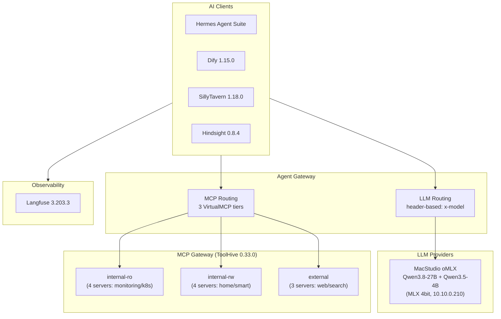

# AI Infrastructure Summary

Last updated: 2026-08-28
Source: Flux manifests in `kubernetes/apps/`.

## Architecture Overview



## Agent Gateway — Central LLM + MCP Router

The agent gateway is the single entry point for all AI traffic. Every AI app routes through it — no app talks to an LLM or MCP server directly.

### LLM Backends (header-based routing on `/chat`)

| Route Header                             | Backend               | Model                              | Provider            |
| ---------------------------------------- | --------------------- | ---------------------------------- | ------------------- |
| `x-model: complex` or `x-priority: high` | `llm-backend-complex` | `qwen3.8-27b`                      | **Local** MacStudio        |
| `x-model: fast`                          | `llm-backend-fast`    | `qwen3.5-4b`                       | **Local** MacStudio        |
| `x-model: memory`                        | `llm-backend-memory`  | `qwen3.5-4b`                       | **Local** MacStudio |
| `x-model: vision`                        | `llm-backend-vision`  | `qwen3.5-4b` (vision-capable)      | **Local** MacStudio |

All backends speak OpenAI-compatible API. Auth via ExternalSecret-managed API keys. Every lane now runs on the MacStudio inference host (`studio.homelab.internal`, 10.10.0.210, oMLX OpenAI-compatible endpoint) — no external LLM API dependency remains. `complex`/`x-priority: high` uses Qwen3.8-27B; `fast`/`memory`/`vision` use Qwen3.5-4B (a unified vision-language model, one endpoint serves all three lanes). No cloud fallback is configured — the studio is a deliberate SPOF.

### Intranet exposure

The gateway API surface is exposed to the intranet via `kgateway-internal` (10.10.0.131) at `https://ai.noirprime.com`:

- `/chat` — LLM routing (strict API key, 300s timeout, promptGuard guardrails)
- `/mcp` — MCP tool routing (strict API key, backend guardrails)
- `/ui` — agentgateway dashboard

TLS terminates at kgateway (cert-manager `noirprime-com-tls`); external-dns auto-creates the AdGuardHome record. Machine clients authenticate with agentgateway API keys — no SSO extAuth on API paths. Reachable from trusted VLANs (10/100/200); IoT VLAN 210 is ACL-blocked from RFC1918.

### App → model lane

| App                  | Lane              | Model              | Notes                                                        |
| -------------------- | ----------------- | ------------------ | ------------------------------------------------------------ |
| hermes-agent         | `complex`         | Qwen3.8-27B        | Agentic reasoning / KB QA / automation; set via 1Password (out-of-band) |
| hindsight            | `memory`          | Qwen3.5-4B         | Extraction-dominant (single-model constraint); embeddings + reranker direct to studio |
| firecrawl            | `fast`            | Qwen3.5-4B         | Batch page extraction/summarization                          |
| karakeep             | `fast` + `vision` | Qwen3.5-4B         | Text + image tagging                                         |
| home-assistant-sgcc  | `vision`          | Qwen3.5-4B         | Meter/bill photo OCR                                         |
| SillyTavern          | UI-configured     | Gemma4-31B lane    | Creative/RP; no repo-level config                            |
| open-notebook        | UI-configured     | suggest `complex`  | Research synthesis; no repo-level config                     |

### MCP Backend

Routes to 3 **ToolHive VirtualMCP servers** (`StreamableHTTP` on port 8080):

- `vmcp-internal-ro` — read-only monitoring/k8s tools
- `vmcp-internal-rw` — read-write home/smart tools
- `vmcp-external` — external web/search tools

---

## LLM Inference — Local

All local lanes (`fast`/`memory`/`vision`) run on the MacStudio inference host. The in-cluster llama.cpp deployment (`llama-qwen3`) was archived 2026-08-28 (`.archived/kubernetes/servitor/llama`); its 50Gi CephFS PVC `llama` is retained for manual cleanup.

---

## AI Agent Platform

### Hermes Agent Suite

| Component | Port | Notes                       |
| --------- | ---- | --------------------------- |
| Dashboard | 9119 | SSO-protected               |
| Gateway   | 8642 | Internal, health: `/health` |
| Web UI    | 8787 | SSO-protected               |

- **Runtime**: Kata Containers (VM isolation)
- **Resources**: req: 200m CPU / 1Gi RAM, lim: 4Gi RAM
- **Integrations**: WeChat, Firecrawl (internal), ToolHive MCP, Agent Gateway LLM
- **Egress**: CiliumNetworkPolicy — only agentgateway-proxy, virtualmcp, kube-dns
- **Depends on**: `agentgateway` (Flux dependency)

---

## LLM Application Platform

### Dify 1.15.0

| Component     | Image                                       | Resources                    |
| ------------- | ------------------------------------------- | ---------------------------- |
| api           | `langgenius/dify-api:1.15.0`                | req: 100m / 512Mi, lim: 1Gi  |
| web           | `langgenius/dify-web:1.15.0`                | req: 20m, lim: 256Mi         |
| worker        | `langgenius/dify-api:1.15.0`                | req: 200m / 1Gi, lim: 2Gi    |
| beat          | `langgenius/dify-api:1.15.0`                | req: 10m / 128Mi, lim: 256Mi |
| sandbox       | `langgenius/dify-sandbox:0.2.15`            | req: 20m, lim: 1Gi (Kata)    |
| proxy         | `ubuntu/squid:5.2-22.04_beta`               | req: 20m, lim: 256Mi         |
| plugin-daemon | `langgenius/dify-plugin-daemon:0.6.3-local` | req: 20m, lim: 1Gi           |

- **Backends**: CloudNativePG (PGVector), Dragonfly Redis (DB 0/1/2), Ceph S3
- **Sandbox**: Kata Containers, max_workers=4, routes egress through squid proxy
- **Model providers**: Configured at runtime via Dify admin UI, not in manifests
- **Depends on**: proxy → database → sandbox → api → (worker, beat, web)

---

## MCP Gateway

### ToolHive 0.33.0 (Stacklok)

- **Operator**: namespace-scoped RBAC
- **Embedding Server**: 2 replicas, req: 500m/512Mi, lim: 2 CPU/1Gi, 5Gi model cache
- **3 Virtual MCP Servers** with:
  - Hybrid semantic search (0.6 semantic / 0.4 keyword ratio)
  - Circuit breaker (3 failures → 30s timeout)
  - OTEL telemetry (5% sampling)
- **Ingress restricted**: Only vmagent and hermes-agent can connect

### MCP Servers (11 total)

#### internal-ro (read-only, no egress)

| Server        | Transport             | Connects To                   |
| ------------- | --------------------- | ----------------------------- |
| victoria-logs | HTTP :8081            | VictoriaLogs                  |
| kubernetes    | HTTP :8080            | kube-apiserver (read-only SA) |
| grafana       | Streamable HTTP :8000 | Grafana                       |
| fluxcd        | HTTP :9090            | Flux (read-only SA)           |

#### internal-rw (read-write, no egress)

| Server         | Transport            | Connects To            |
| -------------- | -------------------- | ---------------------- |
| honcho         | HTTP proxy :8080     | Honcho API             |
| home-assistant | HTTP (FastMCP) :8086 | Home Assistant         |
| hindsight      | HTTP proxy :8080     | Hindsight MCP endpoint |
| fast-note-sync | HTTP proxy :8080     | Fast Note Sync API     |

#### external (full egress)

| Server    | Transport             | Notes                    |
| --------- | --------------------- | ------------------------ |
| github    | HTTP :8082            | Read-only PAT, 7 tools   |
| firecrawl | Streamable HTTP :3000 | Local Firecrawl instance |
| context7  | stdio :3000           | Context7 API             |

---

## LLM Observability

### Langfuse 3.203.3

| Component | Image                                      | Resources            |
| --------- | ------------------------------------------ | -------------------- |
| web       | `ghcr.io/langfuse/langfuse:3.203.3`        | req: 1 CPU, lim: 2Gi |
| worker    | `ghcr.io/langfuse/langfuse-worker:3.203.3` | req: 2 CPU, lim: 4Gi |

- **Backends**: ClickHouse (analytics), Dragonfly Redis (cache/queue), Ceph S3 (events/exports), CloudNativePG (metadata)
- **Features**: Experimental features enabled, telemetry disabled

---

## AI-Adjacent Services

### SillyTavern 1.18.0

- AI character chat frontend, `ghcr.io/sillytavern/sillytavern:1.18.0`, port 8000
- Discreet login (user accounts disabled), local-only persistence

### Firecrawl

- Web scraping pipeline for AI data ingestion
- 3 containers: api (:3002), nuq-worker (:3006), playwright-service (:3000)
- `ghcr.io/firecrawl/firecrawl:latest`, Kata runtime
- Backed by SearXNG, Dragonfly Redis, nuq-postgres
- Exposed as MCP server + internal endpoint for Hermes

### Open-Notebook 1.14.0

- AI-powered research notebook, `ghcr.io/lfnovo/open-notebook:1.14.0`
- UI (:8502 Streamlit) + REST API (:5055), SurrealDB backend
- No public ingress

### Hindsight 0.9.2

- AI memory / context store (agent long-term memory: retain / recall / reflect)
- Image: upstream `ghcr.io/vectorize-io/hindsight:0.9.2-slim` — no in-process local-ml
- LLM: `memory` lane → **Qwen3.5-4B on the MacStudio** (via agentgateway)
- Embeddings: **Qwen3-Embedding-4B on the MacStudio** (oMLX, OpenAI-compatible `/v1/embeddings`)
- Reranker: **Qwen3-Reranker-0.6B on the MacStudio** (Cohere-compatible `/v1/rerank`)
- Resources: req: 200m CPU / 512Mi, lim: 2 CPU / 2Gi
- Storage: CloudNativePG (vchord vector + pgroonga text search), OTEL enabled
- Exposed as MCP server for agent context retrieval

### Archived

- **Buzz** (relay + buzz-agent-omp) — archived 2026-08-28 (`.archived/kubernetes/servitor/buzz`); hermes-agent is the only in-cluster agent.
- **Devbox** — removed from cluster 2026-08-05; image retained in `soulwhisper/containers` as an ad-hoc exec sandbox.
- **llama.cpp (llama-qwen3)** — archived 2026-08-28; all local lanes moved to the MacStudio.

---

## Shared Infrastructure (all AI apps depend on)

| Service                     | Namespace           | Purpose                                             |
| --------------------------- | ------------------- | --------------------------------------------------- |
| **Agent Gateway**           | `networking-system` | LLM + MCP routing                                   |
| **CloudNativePG**           | `database-system`   | PostgreSQL + PGVector for Dify, Langfuse, Hindsight |
| **Dragonfly**               | Various             | Redis-compatible cache/queue                        |
| **ClickHouse**              | `database-system`   | Langfuse analytics                                  |
| **Ceph (Rook)**             | `storage-system`    | S3 + block + CephFS for model/data storage          |
| **Kata Containers**         | `kube-system`       | VM isolation for sandboxed workloads                |
| **kgateway**                | `networking-system` | API gateway + SSO extAuth                           |
| **Authentik**               | `security-system`   | SSO for all public AI endpoints                     |
| **Cert-Manager**            | `security-system`   | TLS certificates                                    |
| **VictoriaMetrics**         | `monitoring-system` | Metrics for ToolHive + OTEL                         |
| **OpenTelemetry Collector** | `monitoring-system` | Traces/metrics pipeline                             |

## Model Routing Summary

```
x-priority: high  ──────────► Qwen3.8-27B                  (local, MacStudio)
x-model: complex  ──────────► Qwen3.8-27B                  (local, MacStudio)
x-model: fast     ──────────► Qwen3.5-4B                   (local, MacStudio)
x-model: memory   ──────────► Qwen3.5-4B                   (local, MacStudio)
x-model: vision   ──────────► Qwen3.5-4B (vision)         (local, MacStudio)
```

All routing is internal via the agent gateway. No app has direct LLM provider access — the gateway is the single choke point for auth, routing, and observability.
