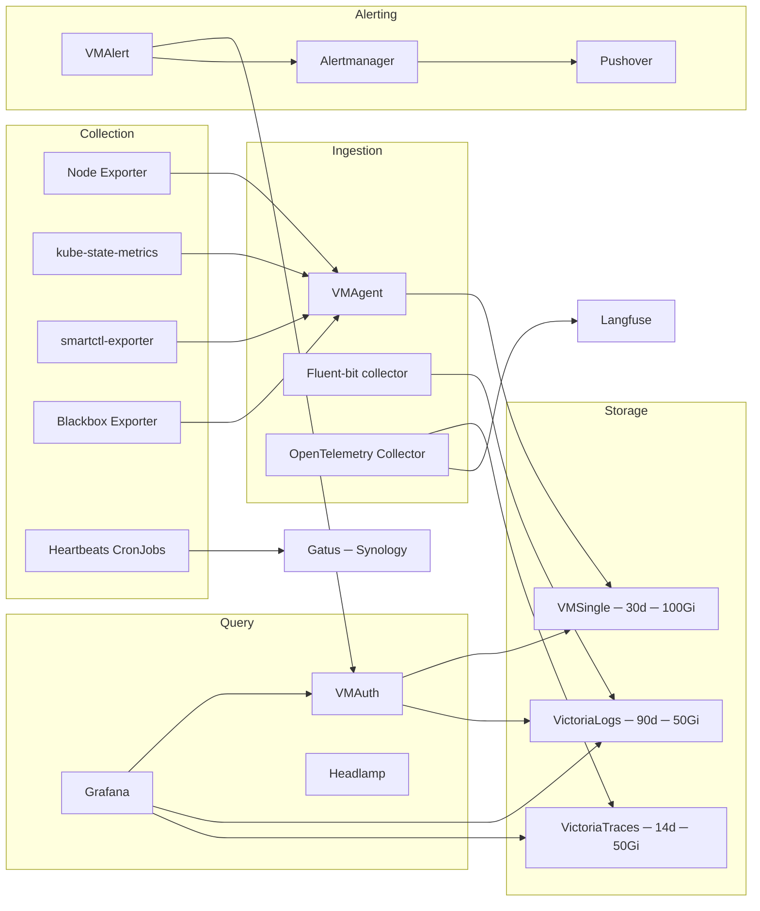

# Observability

The observability stack provides metrics, logs, traces, alerting, and cluster visibility across the homelab. All components are managed by Flux via OCIRepository HelmReleases in the `monitoring-system` namespace.

## Architecture overview



## VictoriaMetrics cluster

The metrics stack uses VictoriaMetrics deployed as the `victoria-metrics-k8s-stack` chart. Built-in Prometheus Operator, node-exporter, kube-state-metrics, and Grafana are disabled in favor of standalone deployments at controlled versions.

### VMSingle

Single-node time-series database with 30-day retention and 100Gi Ceph block storage (`ceph-block` StorageClass). Series cardinality is capped to protect Ceph: `storage.maxHourlySeries: 200000`, `storage.maxDailySeries: 500000`. Internal endpoint: `vmsingle-victoria-metrics-cluster.monitoring-system.svc.cluster.local:8428`. UI exposed at `metrics.noirprime.com` (root path rewritten to `/vmui/`).

High-cardinality metric relabeling drops unnecessary histogram buckets and labels at scrape time (kube-apiserver request duration buckets, admission metrics, kubelet runtime/PLEG operation buckets). Container blkio metrics are preserved for per-pod IOPS panels.

### VMAgent

Scrapes PodMonitors, ServiceMonitors, Probes, and ScrapeConfigs cluster-wide. Configured with `promscrape.dropOriginalLabels: "true"` to reduce label cardinality. Internal endpoint: `vmagent-victoria-metrics-cluster.monitoring-system.svc.cluster.local:8429`.

**Custom ScrapeConfigs** extend scraping beyond the cluster boundary:

| Config | Target | Notes |
|--------|--------|-------|
| `synology-snmp` | `nas.homelab.internal` | SNMP exporter via SNMP generator module |
| `synology-node` | `nas.homelab.internal:9100` | External node_exporter on Synology |
| `synology-smart` | `nas.homelab.internal:9633` | External smartctl-exporter on Synology |

### VMAuth

Multi-tenant read proxy at `vmauth-victoria-metrics-cluster.monitoring-system.svc.cluster.local:8427`. Routes by path prefix:

| Path prefix | Upstream |
|-------------|----------|
| `/api/v1/query.*`, `/api/v1/label/.*` | VMSingle (8428) |
| `/select/logsql/.*` | VictoriaLogs server (9428) |

VMAuth is the single read endpoint used by VMAlert for both metrics and logs rule evaluation.

### VMAlert

Alerting rules engine with datasource pointed at VMAuth (`8427`). Internal endpoint: `vmalert-victoria-metrics-cluster.monitoring-system.svc.cluster.local:8080`.

**Metrics alert rules** (standard PromQL):

| Group | Alerts |
|-------|--------|
| `dockerhub.rules` | `DockerhubRateLimitRisk` — > 100 Docker Hub images active |
| `oom.rules` | `OOMKilled` — container restart with OOMKilled reason |
| `k8s.rules` | `HighContainerNonZeroExits` — > 5 non-zero exits in 15m |
| `smartctl-exporter.rules` | SMART temperature, test failure, critical warnings, media errors, available spare, interface speed |

**Logs alert rules** (LogsQL, `type: vlogs`):

| Group | Alerts |
|-------|--------|
| `vlogs.rules` | `HasErrorLog` — prod error/warn log count > 0; `TooManyFailedRequest` — IPs with >1% failed requests |

### Alertmanager

Single Alertmanager instance at `vmalertmanager-victoria-metrics-cluster.monitoring-system.svc.cluster.local:9093`. UI at `alert.noirprime.com`.

**Routing**: alerts grouped by `alertname` and `job`. Group interval 10m, repeat 12h. Info/warning/critical alerts route to `default` receiver (Pushover). `InfoInhibitor` and `Watchdog` alerts are blackholed.

**Inhibition**: critical alerts suppress warning alerts for the same `alertname` + `namespace`.

**Pushover integration**: notifications delivered via Pushover with HTML formatting, resolved-alert notifications, priority 1 (firing) / 0 (resolved), and gamelan sound. Credentials sourced from 1Password via ExternalSecret.

## VictoriaLogs

Single-node log storage using the `victoria-logs-single` chart. 90-day retention with 50Gi Ceph block storage. Server at `victoria-logs-server.monitoring-system.svc.cluster.local:9428`. UI at `logs.noirprime.com` (root rewritten to `/select/vmui/`). ServiceMonitor enabled for self-monitoring.

### Fluent-bit collector

The `victoria-logs-collector` chart deploys Fluent-bit as a DaemonSet (per-node log collection). Remote write target: `http://victoria-logs-server.monitoring-system.svc.cluster.local:9428` with 10GB per-URL disk buffer for resilience during server downtime.

Stream fields preserved: `kubernetes.pod_name`, `kubernetes.pod_namespace`, `kubernetes.container_name`, `kubernetes.pod_labels.app.kubernetes.io/name`. ANSI escape sequences stripped from `_msg` via `kubernetesCollector.decolorizeFields`.

Logs are queried through VMAuth (LogsQL endpoint), Grafana (VictoriaLogs datasource, traces-to-logs correlation), and directly for VMAlert vlogs-type rules.

## VictoriaTraces

Single-node trace storage using `victoria-traces-single` chart. 14-day retention with 50Gi Ceph block storage. Server at `victoria-traces.monitoring-system.svc.cluster.local:10428`. UI at `traces.noirprime.com` (root rewritten to `/select/vmui/`). ServiceMonitor enabled.

Grafana datasource configured as Jaeger type (`/select/jaeger`), with traces-to-logs correlation (`victoria-logs` datasource, ±1m window, matched on `service.name`), traces-to-metrics correlation (VictoriaMetrics datasource, ±2m window), node graph, and duration span bars.

## OpenTelemetry Collector

Deployed via the `opentelemetry-collector` Helm chart in **deployment** mode with **2 replicas**. Image: `otelcol-k8s` distribution with `GOMEMLIMIT` enabled.

### Receivers

| Protocol | Port | Transport |
|----------|------|-----------|
| OTLP gRPC | 4317 | TCP, `appProtocol: grpc` |
| OTLP HTTP | 4318 | TCP |
| Prometheus (self) | 8888 | Pull-based metrics export |

Jaeger, Zipkin, and legacy receivers disabled.

### Processors

| Processor | Pipeline(s) | Purpose |
|-----------|-------------|---------|
| `memory_limiter` | All | Soft limit 80%, spike limit 25% |
| `k8sattributes` | `traces/app` | Kubernetes pod/namespace enrichment |
| `tail_sampling` | `traces/app` | Error traces always kept; latency >5s kept; 10% probabilistic baseline |
| `redaction/credentials` | `traces/servitor` | Blocks GitHub tokens, AWS keys, JWTs, 1Password refs, private keys, Bearer tokens |
| `filter/gen_ai` | `traces/servitor` | Drops spans with `gen_ai.system` attribute set |
| `batch` | All | 1024 batch, 2048 max, 1s timeout |

### Dual export

Two independent trace pipelines share the same OTLP receiver input:

1. **`traces/app`** — application traces flow through memory limiter → k8s attributes → tail sampling (5% effective for normal traces) → batch → **VictoriaTraces** (`/insert/opentelemetry/v1/traces`)
2. **`traces/servitor`** — servitor (LLM agent) traces flow through memory limiter → credential redaction → gen_ai filter → batch → **Langfuse** (`/api/public/otel`)

Both exporters use queued retry with 10 consumers, 5000 queue depth, and exponential backoff (5s initial, 30s max, 300s elapsed).

## Grafana

Grafana 12.3.1 is managed by the **Grafana Operator** (`grafana-operator` Helm chart, 1 replica), not via the Helm chart directly. The `Grafana` CR declares the full deployment spec: 2 replicas with `topologySpreadConstraints` (hostname skew). PostgreSQL-backed (CNPG `postgres-rw.database-system`), `grafana-initdb` secret for automatic database provisioning.

### Authentication

Authentik OIDC SSO with auto-login and disabled login form. Role mapping via `role_attribute_path`: `homelab-admin` group members get `GrafanaAdmin`; everyone else gets `Viewer`. Admin credentials and OIDC client secret sourced from 1Password via ExternalSecret (`admin-user`, `admin-password`, `oidc_client_id`, `oidc_client_secret`). Endpoint: `grafana.noirprime.com`.

### Datasources

| Datasource | Type | Endpoint | Default |
|-----------|------|----------|---------|
| `victoria-metrics` | `victoriametrics-metrics-datasource` | VMSingle:8428 | Yes |
| `victoria-logs` | `victoriametrics-logs-datasource` | VictoriaLogs server:9428 | No |
| `victoria-traces` | `jaeger` | VictoriaTraces:10428 | No |
| `alertmanager` | `alertmanager` | VMAlertmanager:9093 | No |

VictoriaTraces datasource includes traces-to-logs and traces-to-metrics correlation configuration.

### Preinstalled plugins

`grafana-clock-panel`, `victoriametrics-metrics-datasource`, `victoriametrics-logs-datasource`.

### Dashboards

Dashboards are vendir-synced from upstream sources into `_sources/` and converted to ConfigMaps via `configMapGenerator` in kustomize. The Grafana Operator picks them up via `GrafanaDashboard` CRs. Each dashboard set lives in its own `GrafanaFolder`.

| Folder | Source | Dashboards |
|--------|--------|-----------|
| VictoriaMetrics | `VictoriaMetrics/VictoriaMetrics` v1.148.0 | operator, VM agent, VM alert, VM auth, VM single, VM cluster |
| VictoriaMetrics | `VictoriaMetrics/VictoriaLogs` v1.121.0 | VictoriaLogs server, cluster, alert statistics |
| Kubernetes | Grafana.com (IDs 15757-15761, 11454) | API server, global, nodes, namespaces, pods, volumes |
| Cilium | `cilium/cilium` v1.20 | Agent, operator, Hubble |
| Ceph | Grafana.com (IDs 2842, 5336, 5342) | Cluster, OSD, pools |
| Database | `cloudnative-pg/grafana-dashboards` cluster-v0.0.5 | CNPG cluster |
| Database | `dragonflydb/dragonfly-operator` v1.6.1 | Dragonfly |
| Envoy | `envoyproxy/gateway` v1.8.3; Grafana.com (IDs 24457-24459) | Gateway, downstream, upstream, overview |
| Kgateway | `kgateway-dev/dashboards` main | Kgateway dashboards |
| Default | Grafana.com | cert-manager, cloudflared, external-dns, node-exporter-full, smartctl-exporter |
| Infrastructure | Grafana.com (IDs 14284, 18153) | Synology, OpenWrt |
| Devices | Grafana.com (ID 7587) | Blackbox exporter |

## Host, cluster, and disk metrics

### Node Exporter

Standalone `node-exporter` Helm chart — *not* the bundled one from the VictoriaMetrics stack. Ignores container/virtual filesystems and mountpoints under `/var/lib/kubelet/pods`. Instance label rewritten to `NODE.homelab.internal:9100` for consistency. Resources: 23m CPU request, 64Mi memory limit.

### kube-state-metrics

Standalone `kube-state-metrics` chart with Flux CRD support. Drops high-cardinality metrics (`kube_pod_container_status_waiting_reason`, `kube_pod_container_status_terminated_reason`) and init container status variants. Custom `customResourceState` config exports `gotk_resource_info` metrics for Flux Kustomization, HelmRelease, GitRepository, OCIRepository, HelmRepository, HelmChart, and Bucket resources. RBAC extended for `source.toolkit.fluxcd.io`, `kustomize.toolkit.fluxcd.io`, `helm.toolkit.fluxcd.io`, and `notification.toolkit.fluxcd.io`.

### smartctl-exporter

Per-node DaemonSet exposing S.M.A.R.T. disk health metrics from NVMe and SATA drives. ServiceMonitor with instance label rewritten to `NODE.homelab.internal`. Custom PrometheusRules for temperature (>65°C), SMART test failure, critical warnings, media errors, available spare below threshold, and interface speed mismatch.

## Blackbox Exporter

`blackbox-exporter` chart with `http_2xx`, `icmp`, and `tcp_connect` modules (all IPv4-preferred, 5s timeout). ServiceMonitor scrapes at 1m interval. `NET_RAW` capability for ICMP probes. Alert rule: `BlackboxProbeFailed` fires after 15m of probe failure.

### Probe targets

| Probe | Module | Targets |
|-------|--------|---------|
| `devices` | `icmp` | esxi, nas, unifi, zigbee (all `.homelab.internal`) |
| `nfs` | `tcp_connect` | `nas.homelab.internal:2049` |

## Heartbeats

CronJob-based external heartbeat checks using the `app-template` chart. Each script pushes success/failure/duration to the Gatus API on the Synology host (`10.10.0.100:9400`). Authorization via Bearer token from 1Password.

| CronJob | Schedule | Checks |
|---------|----------|--------|
| `ceph-health` | `*/5 * * * *` | Ceph health gauge from rook-ceph-mgr metrics |
| `flux-reconcile` | `*/30 * * * *` | All Flux Kustomization/HelmRelease/Repository Ready conditions |
| `cnpg-backup` | `15 */6 * * *` | Most recent CNPG Backup in 12h window = completed |
| `kopiur-snapshot` | `45 */6 * * *` | All kopiur SnapshotSchedules succeeded within 12h window |

Time zone: `Asia/Shanghai`. All jobs use `alpine/k8s:1.36.2` with minimal resources and `backoffLimit: 0` (no retries).

## Silence Operator

`silence-operator` chart pointed at Alertmanager (`vmalertmanager-victoria-metrics-cluster.monitoring-system.svc.cluster.local:9093`). Silences are declared as CRs (`Silence` kind) and kept in-cluster — no network policy enforcement.

**Active silences**:

| Silence | Matchers | Reason |
|---------|----------|--------|
| `ceph-node-diskspace-warning-local` | `CephNodeDiskspaceWarning` on `/dev/sd.*` | Local drives are managed |
| `ceph-node-diskspace-warning-nfs` | `CephNodeDiskspaceWarning` on `/etc/nfsmount.conf` | NFS mount, not disk |
| `nas-memory-usage` | `NodeMemoryHighUtilization` on NAS | Synology always reports high memory (ZFS ARC) |
| `talos-kubelet-ephemeral-fs` | `NodeFilesystemAlmostOutOfSpace` on `/var/lib/kubelet/pods` | Expected fullness during workloads |
| `bond-flap-during-upgrade` | `NodeNetworkInterfaceFlapping` on bond0/enp2s0f* | Expected flapping during Talos upgrades |
| `cilium-rolling-upgrade-churn` | `CiliumIdentitiesChurning` | Churn during rolling restarts |

## Headlamp

Headlamp K8s web UI deployed with 1 replica at `headlamp.noirprime.com`. Uses a read-only `view` ClusterRole (aggregated, excludes secrets) extended with Flux CRD read access (`headlamp-flux-view` aggregated ClusterRole). Kubeconfig generated at init via SA token. OIDC SSO via Authentik (client credentials from ExternalSecret). Flux plugin (`headlamp-plugin-flux:v0.6.0`) copied at init.

## Langfuse

LLM observability platform for tracing servitor (agent) interactions. Two components, both using `app-template` chart:

| Component | Image | Resources |
|-----------|-------|-----------|
| `langfuse-web` | `ghcr.io/langfuse/langfuse:3.224.2` | 1 CPU request, 2Gi memory limit |
| `langfuse-worker` | `ghcr.io/langfuse/langfuse-worker:3.224.2` | 2 CPU request, 4Gi memory limit |

### Storage backends

| Backend | Technology | Purpose |
|---------|-----------|---------|
| Metadata DB | CNPG (PostgreSQL) | Langfuse schema via `postgres-init` init container |
| Analytics DB | ClickHouse `default-clickhouse.database-system:9000` | Trace/token analytics, `langfuse` database |
| Cache/Queue | Dragonfly `langfuse-dragonfly.monitoring-system:6379` | Redis-compatible, TLS disabled |
| Object store | Ceph RGW (S3) `langfuse` bucket | Event uploads (`events/`), media uploads (`media/`), batch exports disabled |

Web component exposed at `langfuse.noirprime.com`. Telemetry disabled. Experimental features enabled.

### Traces ingestion

OTel Collector routes servitor traces to Langfuse's OTLP endpoint (`langfuse-web:3000/api/public/otel`) after credential redaction and gen_ai span filtering. See [OpenTelemetry Collector](#opentelemetry-collector) for pipeline details.

## Alert routing

```
VMAlert rules (PromQL + LogsQL)
  │
  ▼
VMAuth (read proxy for VMSingle + VictoriaLogs)
  │
  ▼
Alertmanager ──► blackhole (InfoInhibitor, Watchdog)
  │
  ▼
Pushover (mobile notifications)
  ├── severity: critical → priority 1 (high)
  ├── severity: warning → priority 0 (normal)
  ├── sendResolved: true
  └── sound: gamelan
```

Alertmanager groups alerts by `alertname` + `job`, waits 1m before first notification, and repeats every 12h. Credentials (token + user key) from 1Password via ExternalSecret.

## External observation

### Gatus on Synology

Gatus runs on the Synology NAS (`10.10.0.100:9400`) as an external observer per the [public exposure ADR](../decisions/public-exposure.md). Heartbeat CronJobs push endpoint status to Gatus, providing an independent health check path outside the Kubernetes cluster. This validates that external services are reachable even when cluster-internal monitoring is degraded.
