# Cluster Architecture

## Overview

The home-ops Kubernetes cluster runs on Talos Linux, managed entirely through GitOps with Flux CD. Every resource — from cluster-wide operators to individual applications — is declared in this repository and reconciled automatically. The architecture is built around four design principles:

1. **Git as the single source of truth** — No `kubectl apply` or manual Helm installs. Everything flows through Flux.
2. **Composability through Kustomize** — Six reusable Kustomize Components encode cross-cutting concerns so individual applications stay lean.
3. **OCI-first chart sourcing** — All Helm charts are pulled from OCI registries; legacy `HelmRepository` resources are eliminated entirely.
4. **Layered patching** — Three strategic patch layers inject defaults at the cluster level, eliminating boilerplate from every application definition.

```mermaid
flowchart TB
    subgraph Source["Source of Truth"]
        GIT["Git Repository
        github.com/soulwhisper/home-ops"]
    end

    subgraph Bootstrap["Bootstrap (helmfile)"]
        direction LR
        B1["prometheus-crds"] --> B2["cilium"]
        B2 --> B3["coredns"]
        B3 --> B4["spegel"]
        B4 --> B5["gateway-api-crds"]
        B5 --> B6["external-secrets"]
        B6 --> B7["flux-operator"]
        B7 --> B8["flux-instance"]
    end

    subgraph FluxTopo["Flux Reconciliation Topology"]
        GR["GitRepository
        gitops-system"] --> FR["flux-repositories
        Kustomization"]
        FR --> CA["cluster-apps
        Kustomization"]
        CA --> NS["13 Namespace
        Kustomizations"]
        NS --> APPS["90 Application
        Kustomizations"]
    end

    subgraph Components["Kustomize Components"]
        NS_COMP["namespace
        13 consumers"]
        KOPIUR["kopiur
        24 consumers"]
        AUTHENTIK["authentik
        14 consumers"]
        CNPG["cnpg
        8 consumers"]
        DRAGONFLY["dragonfly
        7 consumers"]
        CEPH["ceph-bucket
        1 consumer"]
    end

    subgraph Charts["Chart Sources"]
        OCI_OWN["53 Own
        OCIRepositories"]
        OCI_TPL["1 app-template
        OCIRepository"]
        CROSS["37 Cross-namespace
        chartRef References"]
    end

    GIT --> Bootstrap
    Bootstrap --> GR
    GR --> FR
    FR --> CA
    CA -.-> NS
    NS -.-> APPS
    APPS -.-> Components
    APPS --> OCI_OWN
    APPS --> OCI_TPL
    OCI_TPL --> CROSS
```



## Flux Topology

The reconciliation chain follows a strict hierarchy: one `GitRepository` feeds two cluster-level `Kustomization` resources, which recursively discover and reconcile every application in the tree.

### GitRepository → Cluster Kustomizations

A single `GitRepository` named `gitops-system` watches the `main` branch of `github.com/soulwhisper/home-ops`. It is declared by the `flux-instance` HelmRelease at bootstrap time (`kubernetes/apps/gitops-system/flux-instance/app/helmrelease.yaml:L24-L28`):

```yaml
sync:
  kind: GitRepository
  url: https://github.com/soulwhisper/home-ops.git
  ref: refs/heads/main
  path: kubernetes/flux/cluster
```

The cluster-level `Kustomization` resources live in `kubernetes/flux/cluster/cluster.yaml` and form a two-stage pipeline:

| Kustomization       | Path                             | Depends On          | Purpose                                                |
| ------------------- | -------------------------------- | ------------------- | ------------------------------------------------------ |
| `flux-repositories` | `./kubernetes/flux/repositories` | _(none)_            | Registers shared OCI chart sources                     |
| `cluster-apps`      | `./kubernetes/apps`              | `flux-repositories` | Recursively reconciles all namespaces and applications |

### Recursive Discovery

`cluster-apps` scans `kubernetes/apps/` recursively. Flux discovers each namespace's top-level `kustomization.yaml`, which references individual application `ks.yaml` files. This yields **13 namespace Kustomizations** and **90 application Kustomizations** (`ks.yaml` leaves).

Each application `ks.yaml` is a leaf `Kustomization` that points to its `app/` subdirectory containing the `HelmRelease`, `OCIRepository`, and any supplementary resources (ConfigMaps, Secrets, etc.).

### Flux Controller Tuning

The Flux controllers are configured with aggressive tuning for a single-node cluster (`kubernetes/apps/gitops-system/flux-instance/app/helmrelease.yaml:L37-L118`):

- **Concurrency**: `--concurrent=10` on kustomize, helm, and source controllers
- **Dependency requeue**: `--requeue-dependency=5s` for fast dependency resolution
- **Memory limits**: 2 GiB per controller
- **In-memory builds**: Kustomize builds use `emptyDir` backed by `Memory` medium
- **Helm caching**: 10-max cache with 60m TTL and 5m purge interval
- **OOM watch**: 95% threshold with 500ms check interval
- **Cancel health checks**: `CancelHealthCheckOnNewRevision=true` prevents stale health checks from blocking new revisions
- **Chart digest tracking**: Disabled via `DisableChartDigestTracking=true`

## Strategic Patching System

The `cluster-apps` Kustomization applies three strategic patches to every child `Kustomization` in the tree. These are defined in `kubernetes/flux/cluster/cluster.yaml` and eliminate boilerplate from all 90 application definitions.

### Layer 1: Kustomization Defaults (managed annotation)

**Target**: Any `Kustomization` with annotation `config.home-ops.io/managed=true`

Every application `ks.yaml` carries this annotation. The patch injects:

```yaml
spec:
  interval: 1h
  timeout: 5m
  sourceRef:
    kind: GitRepository
    name: gitops-system
    namespace: gitops-system
  prune: true
  wait: false
```

This means individual `ks.yaml` files never need to declare their `sourceRef`, `prune` behavior, or reconciliation interval — they only specify what varies: `targetNamespace`, `path`, `dependsOn`, `components`, and `postBuild`.

### Layer 2: Baseline Infrastructure Dependencies (deps label)

**Target**: Any `Kustomization` with label `config.home-ops.io/deps=infra`

Applications that require the foundational infrastructure layer (most user-facing workloads) carry this label. The patch injects a `dependsOn` block ensuring these four components are healthy before reconciliation begins:

```yaml
spec:
  dependsOn:
    - name: cert-manager
      namespace: security-system
    - name: onepassword-connect
      namespace: security-system
    - name: rook-ceph-cluster
      namespace: storage-system
    - name: kopiur
      namespace: storage-system
```

Applications can append additional app-specific dependencies in their own `ks.yaml` — Flux merges the lists. For example, `moviepilot` adds `cnpg-cluster`, `dragonfly-operator`, and `media-nfs` on top of the baseline (`kubernetes/apps/media-apps/moviepilot/ks.yaml:L17-L23`).

### Layer 3: HelmRelease Defaults (all child Kustomizations)

**Target**: Every child `Kustomization` under `cluster-apps`

This patch injects a `patches` block into each application `Kustomization` that targets all `HelmRelease` resources within that app:

```yaml
spec:
  maxHistory: 1
  install:
    crds: CreateReplace
    strategy:
      name: RetryOnFailure
    remediation:
      retries: -1 # retry indefinitely until success
  rollback:
    cleanupOnFail: true
    recreate: true
  upgrade:
    cleanupOnFail: true
    crds: CreateReplace
    strategy:
      name: RemediateOnFailure
    remediation:
      remediateLastFailure: true
      retries: 3
  uninstall:
    keepHistory: false
```

Key behaviors this enforces cluster-wide:

- **CRD lifecycle**: CRDs are created and upgraded automatically (`CreateReplace`), eliminating manual CRD management.
- **Install resilience**: `RetryOnFailure` with unlimited retries (`-1`) ensures initial installs survive transient errors.
- **Upgrade safety**: `RemediateOnFailure` with 3 retries and automatic rollback (`cleanupOnFail`, `recreate`) contains bad upgrades.
- **History hygiene**: `maxHistory: 1` and `keepHistory: false` prevent Helm release history accumulation.

## OCI-First Strategy

All Helm charts are sourced from OCI registries. The legacy `HelmRepository` CRD is eliminated — every chart reference uses `OCIRepository` exclusively.

### Own OCIRepositories (53)

Each non-trivial application defines its own `OCIRepository` resource in its `app/` subdirectory alongside its `HelmRelease`. These 53 repositories pull charts directly from their publishers' OCI registries:

| Namespace         | Count | Example Charts                                                                                                                                                                                                                                        |
| ----------------- | ----- | ----------------------------------------------------------------------------------------------------------------------------------------------------------------------------------------------------------------------------------------------------- |
| kube-system       | 11    | cilium, coredns, spegel, frr-k8s, descheduler, reloader, metrics-server, k8tz, gateway-api-crds, intel-device-plugins (operator + GPU)                                                                                                                |
| security-system   | 4     | authentik, cert-manager, external-secrets, onepassword-connect                                                                                                                                                                                        |
| storage-system    | 7     | rook-ceph (app + cluster + drivers), kopiur, snapshot-controller, openebs-localpv, csi-driver-nfs                                                                                                                                                              |
| database-system   | 4     | cloudnative-pg, plugin-barman-cloud, dragonfly-operator, clickhouse-operator                                                                                                                                                                          |
| networking-system | 5     | kgateway (app + CRDs), agentgateway (app + CRDs), externaldns                                                                                                                                                                                         |
| monitoring-system | 15    | victoria-metrics (operator + cluster + app), victoria-logs (app + collector), victoria-traces, grafana, kube-state-metrics, node-exporter, prometheus-crds, blackbox-exporter, smartctl-exporter, opentelemetry-collector, silence-operator, headlamp |
| gitops-system     | 3     | flux-operator, flux-instance, tuppr (system-upgrade-controller)                                                                                                                                                                                       |
| others            | 4     | toolhive (app + CRDs), woodpecker, netbox                                                                                                                                                                                                             |

The `OCIRepository` fetches only the chart layer via `layerSelector` with `operation: copy`, which extracts the Helm chart tarball from the OCI manifest without pulling unrelated layers.

### App-Template Pattern (37 Cross-Namespace References)

For applications that don't need a custom Helm chart, the **app-template** pattern is used. A single `OCIRepository` is defined in `kubernetes/flux/repositories/app-template.yaml`:

```yaml
apiVersion: source.toolkit.fluxcd.io/v1
kind: OCIRepository
metadata:
  name: app-template
  namespace: gitops-system
spec:
  interval: 10m
  layerSelector:
    mediaType: application/vnd.cncf.helm.chart.content.v1.tar+gzip
    operation: copy
  ref:
    tag: 5.0.1
  url: oci://ghcr.io/bjw-s-labs/helm/app-template
```

Applications reference this chart from any namespace using `chartRef` with an explicit namespace:

```yaml
spec:
  chartRef:
    kind: OCIRepository
    name: app-template
    namespace: gitops-system
```

This cross-namespace reference is used by 37 HelmReleases across 8 namespaces:

| Namespace                   | Count | Example Apps                                                                                                    |
| --------------------------- | ----- | --------------------------------------------------------------------------------------------------------------- |
| media-apps                  | 8     | jellyfin, kavita, navidrome, qbittorrent, immich, moviepilot, metube, qbittorrent-ui                            |
| selfhosted-apps             | 15    | miniflux, rsshub, searxng, sillytavern, stirling-pdf, bambuddy, dispatcharr, karakeep, homepage, fast-note-sync, hindsight, open-notebook (app + database), firecrawl (app + database) |
| smarthome-apps              | 6     | home-assistant (app + sgcc), frigate, zigbee2mqtt, mosquitto, scrypted                             |
| servitor-apps               | 1     | hermes-agent                                                                                       |
| gaming-apps                 | 2     | crafty-controller, foundryvtt                                                                                   |
| monitoring-system           | 3     | langfuse (app + worker), heartbeats                                                                             |
| networking-system           | 1     | agentgateway MCP config                                                                                         |
| database-system             | 1     | cnpg maintenance (dr-test cronjob)                                                                              |

The `flux-repositories` Kustomization is reconciled before `cluster-apps` (via `dependsOn`), ensuring the `app-template` `OCIRepository` is always available before any application HelmRelease references it.

## Kustomize Component System

Six Kustomize Components encode cross-cutting concerns as reusable building blocks. Applications declare which components they need in their `ks.yaml` — the component injects all required resources automatically.

### Component: namespace (13 consumers)

**Path**: `kubernetes/components/namespace/`

Every top-level namespace Kustomization includes this component. It provides:

1. **Namespace resource** with label `kustomize.toolkit.fluxcd.io/prune: disabled` — prevents Flux from ever deleting the namespace, even when `prune: true` is set.
2. **Alert resources** — Flux `Alert` and `Provider` definitions that send notifications to the notification-controller for all Flux resources in the namespace.

```yaml
# kubernetes/components/namespace/labels.yaml
apiVersion: v1
kind: Namespace
metadata:
  name: _
  labels:
    kustomize.toolkit.fluxcd.io/prune: disabled
```

The `name: _` is a Kustomize placeholder — postBuild substitution in each namespace's `kustomization.yaml` fills in the actual namespace name.

### Component: kopiur (24 consumers)

**Path**: `kubernetes/components/kopiur/`

The most heavily used component. It provisions a complete backup-and-recovery pipeline for stateful applications:

| Resource           | Purpose                                                                              |
| ------------------ | ------------------------------------------------------------------------------------ |
| `PersistentVolumeClaim` | Creates the application's data PVC (claims the `Restore` populator via `dataSourceRef`) |
| `ExternalSecret`   | Pulls the kopia repo password and S3 access keys from 1Password into a Secret         |
| `Repository`       | First-class kopia repository: S3 backend (NAS VersityGW), encryption, maintenance     |
| `SnapshotPolicy`   | The backup recipe: CSI snapshot copy method, zstd-fastest, keep-daily 14              |
| `SnapshotSchedule` | Cron invocation of the policy (every 6h, `KOPIUR_SCHEDULE` overridable)               |
| `Restore`          | Passive volume populator: first boot restores the latest snapshot                     |

Applications that need persistent data backed up to S3 include this component. The PVC template is parameterized through `postBuild` substitution with the `APP` variable.

### Component: authentik (14 consumers)

**Path**: `kubernetes/components/authentik/`

Injects a `TrafficPolicy` resource that configures kgateway to require Authentik SSO authentication for the application's route. Applications behind the single sign-on gateway include this component.

The policy enforces:

- Forward auth via Authentik's outpost
- Unauthenticated requests redirected to the Authentik login flow
- Session validation on every request

### Component: cnpg (8 consumers)

**Path**: `kubernetes/components/cnpg/`

Injects an `ExternalSecret` that provisions a CloudNativePG database user secret from 1Password. Applications that need a PostgreSQL database (managed by the CloudNativePG operator) include this component.

The `ExternalSecret` references the 1Password item containing the database connection URI, username, and password, making them available as Kubernetes secrets for the application's pods.

### Component: dragonfly (7 consumers)

**Path**: `kubernetes/components/dragonfly/`

Injects Dragonfly database resources for applications using Dragonfly (a Redis-compatible drop-in):

| Resource     | Purpose                                                      |
| ------------ | ------------------------------------------------------------ |
| `Dragonfly`  | Declares a Dragonfly instance with the application's name    |
| `PodMonitor` | Configures Prometheus metrics scraping for the Dragonfly pod |

Applications with caching or session storage requirements include this component.

### Component: ceph-bucket (1 consumer)

**Path**: `kubernetes/components/ceph-bucket/`

Injects an `ObjectBucketClaim` that provisions an S3-compatible bucket from the Rook-Ceph object store. Currently used by `langfuse` for trace and observation storage.

### Component Composition

Applications frequently stack multiple components. For example, `moviepilot` (`kubernetes/apps/media-apps/moviepilot/ks.yaml`) uses three:

```yaml
components:
  - ../../../../components/cnpg # PostgreSQL database
  - ../../../../components/dragonfly # Redis cache
  - ../../../../components/kopiur # PVC backup to S3
```

The most complex stacks combine four components: `netbox` uses `cnpg`, `dragonfly`, `kopiur`, and `authentik`, while `langfuse` uses `cnpg`, `dragonfly`, `ceph-bucket`, and `authentik`.

## Namespace Inventory

The cluster uses 13 namespaces, ordered by dependency from foundational infrastructure to end-user applications:

| #   | Namespace           | Purpose                              | Key Resources                                                                                                                                                                                                                              |
| --- | ------------------- | ------------------------------------ | ------------------------------------------------------------------------------------------------------------------------------------------------------------------------------------------------------------------------------------------ |
| 1   | `kube-system`       | Cluster networking and node services | Cilium CNI, CoreDNS, Spegel mirror, FRR-K8s BGP, Intel GPU plugins, Reloader, Descheduler, k8tz, Gateway API CRDs, Metrics Server, Runtime Classes                                                                                         |
| 2   | `security-system`   | Identity, certificates, secrets      | Authentik SSO, cert-manager, External Secrets Operator, 1Password Connect                                                                                                                                                                  |
| 3   | `storage-system`    | Persistent storage and backups       | Rook-Ceph (block + object), OpenEBS LocalPV, CSI NFS driver, kopiur, Snapshot Controller                                                                                                                                                  |
| 4   | `database-system`   | Database operators                   | CloudNativePG, Dragonfly Operator, ClickHouse Operator                                                                                                                                                                                     |
| 5   | `networking-system` | Ingress, DNS, API gateway            | kgateway (Envoy Gateway), Agent Gateway (AI agent routing), ExternalDNS                                                                                                                                                                    |
| 6   | `monitoring-system` | Observability                        | Victoria Metrics (operator + cluster), Victoria Logs, Victoria Traces, Grafana, Prometheus CRDs, kube-state-metrics, node-exporter, blackbox-exporter, Smartctl exporter, OTel Collector, Silence Operator, Langfuse, Heartbeats, Headlamp |
| 7   | `servitor-apps`     | AI and development tooling           | Hermes Agent, Toolhive, MCP servers                                                                                                                                                                                       |
| 8   | `smarthome-apps`    | Home automation                      | Home Assistant (app + SGCC), Frigate NVR, Zigbee2MQTT, Mosquitto MQTT, Scrypted                                                                                                                                           |
| 9   | `media-apps`        | Media serving and management         | Jellyfin, Kavita, Navidrome, qBittorrent, Immich, MoviePilot, MeTube                                                                                                                                                                       |
| 10  | `selfhosted-apps`   | Self-hosted web services             | Miniflux, RSSHub, SearXNG, NetBox, Stirling PDF, SillyTavern, Karakeep, Homepage, Hindsight, Dispatcharr, BambuBuddy, Fast Note Sync, Open Notebook, Firecrawl                                                                             |
| 11  | `gaming-apps`       | Game servers                         | Crafty Controller (Minecraft), Foundry VTT                                                                                                                                                                                                 |
| 12  | `worker-apps`       | CI/CD and automation                 | Woodpecker CI                                                                                                                                                                                                                      |
| 13  | `gitops-system`     | Flux itself                          | Flux Operator, Flux Instance, System Upgrade Controller                                                                                                                                                                                    |

### Dependency Order

The namespace numbering reflects the reconciliation dependency chain:

1. **kube-system** must be ready first — networking, DNS, and node services are prerequisites for everything else.
2. **security-system** provides TLS certificates and secret management that all upper layers consume.
3. **storage-system** provisions PVCs, snapshots, and S3 buckets that stateful applications depend on.
4. **database-system** runs the operators that create databases for applications.
5. **networking-system** configures ingress routes and DNS records for externally accessible services.
6. **monitoring-system** scrapes metrics and collects logs from all other namespaces.
   7-12. **Application namespaces** depend on layers 1-6 being operational.
7. **gitops-system** runs Flux itself — bootstrapped externally, then self-managed.

## Bootstrap Chain

Before Flux can manage the cluster, the foundational components must be installed. This is handled by a **helmfile** in `kubernetes/bootstrap/helmfile.yaml` — an 8-step sequential pipeline:

```
prometheus-crds → cilium → coredns → spegel → gateway-api-crds → external-secrets → flux-operator → flux-instance
```

### Why helmfile?

Flux cannot install itself. The bootstrap chain uses helmfile for the initial provisioning because:

1. Talos clusters start with no cluster services — not even a CNI.
2. Cilium must be installed before CoreDNS can become ready.
3. CoreDNS must be ready before Spegel (which resolves registry hosts).
4. Spegel provides the OCI registry mirror that subsequent chart pulls use.
5. Gateway API CRDs are needed by kgateway (installed later by Flux).
6. External Secrets provisions 1Password Connect secrets that Flux and applications consume.
7. Flux Operator and Flux Instance are the last step — once they're running, Flux takes over.

### Step Details

| Step                  | Chart                                                                | Values Source        | Purpose                                                                                               |
| --------------------- | -------------------------------------------------------------------- | -------------------- | ----------------------------------------------------------------------------------------------------- |
| 1. `prometheus-crds`  | `oci://ghcr.io/prometheus-community/charts/prometheus-operator-crds` | _(none)_             | Installs Prometheus Operator CRDs (ServiceMonitor, PodMonitor, etc.) before Victoria Metrics operator |
| 2. `cilium`           | `oci://quay.io/cilium/charts/cilium`                                 | `values.yaml.gotmpl` | eBPF-based CNI with Gateway API, BGP, and network policy support                                      |
| 3. `coredns`          | `oci://ghcr.io/coredns/charts/coredns`                               | `values.yaml.gotmpl` | Cluster DNS — can only start after Cilium provides pod networking                                     |
| 4. `spegel`           | `oci://ghcr.io/spegel-org/helm-charts/spegel`                        | `values.yaml.gotmpl` | Stateless OCI registry mirror using P2P image distribution                                            |
| 5. `gateway-api-crds` | `oci://ghcr.io/wiremind/wiremind-helm-charts/gateway-api-crds`       | _(none)_             | Gateway API CRDs (GatewayClass, Gateway, HTTPRoute, etc.)                                             |
| 6. `external-secrets` | `oci://ghcr.io/external-secrets/charts/external-secrets`             | `values.yaml.gotmpl` | Kubernetes External Secrets Operator — syncs secrets from 1Password                                   |
| 7. `flux-operator`    | `oci://ghcr.io/controlplaneio-fluxcd/charts/flux-operator`           | `values.yaml.gotmpl` | Manages Flux Instance lifecycle                                                                       |
| 8. `flux-instance`    | `oci://ghcr.io/controlplaneio-fluxcd/charts/flux-instance`           | `values.yaml.gotmpl` | Creates the GitRepository and Kustomization resources that begin GitOps reconciliation                |

### Values Templating

The `values.yaml.gotmpl` file uses a clever pattern: it reads the Flux-managed `helmrelease.yaml` from the corresponding app directory and extracts the `spec.values` block:

```gotmpl
{{ (fromYaml (readFile (printf "../apps/%s/%s/app/helmrelease.yaml" .Release.Namespace .Release.Name))).spec.values | toYaml }}
```

This means the helmfile bootstrap and the Flux HelmRelease use the **exact same values** — the helmfile just reads them from the same file that Flux will later reconcile. No duplication, no drift.

### Bootstrap Secret

Before running the helmfile, a `1Password Connect` secret must be created manually in the `security-system` namespace. The template is in `kubernetes/bootstrap/resources.yaml.j2`:

```yaml
apiVersion: v1
kind: Secret
metadata:
  name: onepassword-connect
  namespace: security-system
stringData:
  1password-credentials.json: op://DevOps/1password-api/credentials
  token: op://DevOps/1password-api/token
```

This secret is referenced by the external-secrets Operator to authenticate with 1Password Connect and provision all other secrets in the cluster.

## Dependency Injection Label System

Two custom labels and an annotation drive the strategic patching and component injection system:

### `config.home-ops.io/managed: "true"`

**Type**: Annotation
**Purpose**: Opts a `Kustomization` into Layer 1 strategic patching (Kustomization defaults).
**Scope**: Every application `ks.yaml` (90 files).

Without this annotation, a Kustomization would not receive the automatic `sourceRef`, `prune`, `interval`, and `timeout` defaults. Infrastructure-only Kustomizations (like `flux-repositories`) omit it intentionally.

### `config.home-ops.io/deps: "infra"`

**Type**: Label
**Purpose**: Opts a `Kustomization` into Layer 2 strategic patching (baseline infrastructure dependencies).
**Scope**: Applications that need TLS certificates, secrets, storage, and backups before starting (49 `ks.yaml` files).

This label signals "I'm a workload that needs the core infra layer." Infrastructure components themselves (e.g., cert-manager, rook-ceph, cnpg-operator) omit this label — they _are_ the infra, so they only carry `managed: "true"`.

### Combined Effect

A typical application `ks.yaml` with both markers receives:

1. **From Layer 1** (`managed` annotation): `sourceRef`, `prune: true`, `interval: 1h`, `timeout: 5m`
2. **From Layer 2** (`deps=infra` label): baseline `dependsOn` (cert-manager, onepassword-connect, rook-ceph-cluster, kopiur)
3. **From Layer 3** (automatic): HelmRelease defaults (CRD management, retry, remediation, rollback)

The application's own `ks.yaml` only specifies what's unique: `targetNamespace`, `path`, app-specific `dependsOn`, `components`, and `postBuild` substitution.

## Directory Structure

```
kubernetes/
├── apps/                          # All application definitions
│   ├── kube-system/               #  1. Cluster networking and node services
│   │   ├── kustomization.yaml     #     Namespace Kustomization
│   │   └── <app>/                 #     Per-application directory
│   │       ├── ks.yaml            #       Flux Kustomization entrypoint
│   │       └── app/               #       HelmRelease + OCIRepository + resources
│   │           ├── helmrelease.yaml
│   │           ├── ocirepository.yaml
│   │           └── kustomization.yaml
│   ├── security-system/           #  2. Identity, certificates, secrets
│   ├── storage-system/            #  3. Persistent storage and backups
│   ├── database-system/           #  4. Database operators
│   ├── networking-system/         #  5. Ingress, DNS, API gateway
│   ├── monitoring-system/         #  6. Observability stack
│   ├── servitor-apps/             #  7. AI and development tooling
│   ├── smarthome-apps/            #  8. Home automation
│   ├── media-apps/                #  9. Media serving
│   ├── selfhosted-apps/           # 10. Self-hosted web services
│   ├── gaming-apps/               # 11. Game servers
│   ├── worker-apps/               # 12. CI/CD and automation
│   └── gitops-system/             # 13. Flux itself
├── bootstrap/                     # Pre-Flux cluster provisioning
│   ├── helmfile.yaml              #   8-step sequential bootstrap
│   ├── resources.yaml.j2          #   1Password Connect secret template
│   └── values.yaml.gotmpl         #   Values bridge to Flux HelmReleases
├── components/                    # Reusable Kustomize Components
│   ├── namespace/                 #   Namespace + alerts (13 consumers)
│   ├── kopiur/                    #   PVC backup pipeline (backup + secret, 24 consumers)
│   ├── authentik/                 #   SSO traffic policy (14 consumers)
│   ├── cnpg/                      #   PostgreSQL secret (8 consumers)
│   ├── dragonfly/                 #   Redis-compatible cache (7 consumers)
│   └── ceph-bucket/               #   S3 object bucket (1 consumer)
└── flux/                          # Flux cluster configuration
    ├── cluster/
    │   └── cluster.yaml           #   flux-repositories + cluster-apps Kustomizations
    └── repositories/
        ├── kustomization.yaml     #   Shared OCI source registration
        └── app-template.yaml      #   bjw-s app-template OCIRepository
```

## Talos Integration

The cluster runs on Talos Linux, a minimal, API-driven Kubernetes OS. Talos configuration lives in `infrastructure/talos/` and is not managed by Flux — node configuration is applied declaratively via `talosctl apply-config`.

Talos provides:

- **Immutable root filesystem** — no package manager, no SSH, no shell access on nodes
- **API-driven management** — all configuration changes flow through the Talos API
- **Automatic upgrades** — System Upgrade Controller (managed by Flux in `gitops-system`) handles Talos version upgrades via `talosctl upgrade-k8s` plans
- **NVMe storage** — M.2 NVMe SSDs across all nodes provide high-performance local storage for Rook-Ceph and OpenEBS

The cluster uses Cilium as the CNI in native routing mode (no overlay), leveraging Talos's default network configuration and BGP peering via FRR-K8s for LoadBalancer service IP advertisement.

## Renovate Integration

[Renovate](https://github.com/renovatebot/renovate) monitors the repository for dependency updates across all layers:

- **Helm chart versions** in `helmrelease.yaml` files
- **OCIRepository tags** in `ocirepository.yaml` files
- **Container image tags** in HelmRelease values
- **Bootstrap chart versions** in `helmfile.yaml`
- **Talos version** in System Upgrade Controller plans

When updates are detected, Renovate opens pull requests. Merging triggers Flux reconciliation, which applies the new versions automatically. This keeps the entire cluster — from the OS to individual application containers — continuously updated without manual intervention.
