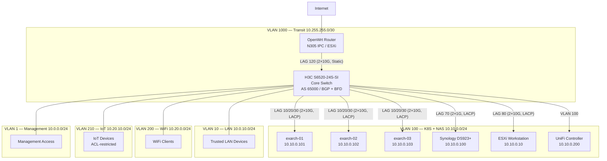

##  Network Architecture

The network is built around an enterprise-grade Layer 3 core switch with eBGP + BFD to the Kubernetes cluster, VLAN segmentation for security isolation, and 10G LACP bonds for all storage and compute paths.

### Physical Topology

```
                  ┌─────────────┐
                  │   Internet   │
                  └──────┬──────┘
                         │ PPPoE
                  ┌──────▼──────┐
                  │  OpenWrt    │
                  │  (N305 IPC) │
                  │ NTP/DNS/VPN │
                  └──┬──────┬───┘
                     │      │
            ┌────────▼──┐ ┌─▼──────────┐
            │ ESXi Host │ │ 10G Transit │
            │ (VMs)     │ │ VLAN 1000   │
            └───────────┘ └──────┬──────┘
                                 │
                  ┌──────────────▼──────────────┐
                  │    H3C S6520-24S-SI          │
                  │    Core Switch (AS 65000)     │
                  │    BGP + BFD + LACP           │
                  └──┬───────┬───────┬───────┬────┘
                     │       │       │       │
            ┌────────▼┐ ┌───▼──┐ ┌──▼───┐ ┌▼────────┐
            │exarch-01│ │ex-02 │ │ex-03 │ │Synology │
            │.101     │ │.102  │ │.103  │ │NAS .100 │
            │2×10G LAG│ │2×10G │ │2×10G │ │2×1G LAG │
            └─────────┘ └──────┘ └──────┘ └─────────┘
            VLAN 100 (10.10.0.0/24) — K8S + NAS
```

| Device             | Role                                  | NIC                   | Uplink                  |
| ------------------ | ------------------------------------- | --------------------- | ----------------------- |
| H3C S6520-24S-SI   | L3 core switch, BGP router (AS 65000) | 24×10G SFP+           | 2×10G LACP to router    |
| Miniforum MS-01 ×3 | Talos K8s control-plane + worker      | Intel X710 2×10G SFP+ | 2×10G LACP per node     |
| N305 IPC           | ESXi 8 hypervisor                     | 2.5G RJ45             | OpenWrt VM + management |
| Synology DS923+    | NAS (NFS, S3, Docker)                 | 2×1G RJ45 LACP        | 2×1G LACP               |
| SANTAK TG-Box 850  | UPS (NUT)                             | USB                   | —                       |



### VLAN Segmentation

The core switch enforces strict L3 isolation between security domains. Inter-VLAN routing is handled by the switch itself; VLAN 1000 provides the transit link to the edge router for WAN egress.

| VLAN | Name       | Subnet          | Gateway      | Purpose                                         | DHCP             |
| ---- | ---------- | --------------- | ------------ | ----------------------------------------------- | ---------------- |
| 1    | Management | 10.0.0.0/24     | 10.0.0.1     | Switch mgmt, ESXi, UniFi, OOB access            | Yes (switch)     |
| 10   | LAN        | 10.0.10.0/24    | 10.0.10.1    | Trusted wired LAN                               | Yes (OpenWrt)    |
| 100  | K8S / NAS  | 10.10.0.0/24    | 10.10.0.1    | Kubernetes nodes, NAS, workstation, BGP peering | Static / OpenWrt |
| 200  | WiFi       | 10.20.0.0/24    | 10.20.0.1    | Trusted wireless clients                        | Yes (OpenWrt)    |
| 210  | IoT        | 10.20.10.0/24   | 10.20.10.1   | Untrusted IoT devices (ACL-isolated)            | Yes (OpenWrt)    |
| 1000 | Transit    | 10.255.255.0/30 | 10.255.255.1 | Switch↔Router point-to-point link               | Static           |

**IoT isolation (VLAN 210):** An advanced ACL (3500) restricts IoT egress to DHCP, DNS (switch only), NTP, and ICMP toward the gateway. Internet access is permitted; all RFC 1918 private ranges are explicitly denied. Inbound from WiFi (VLAN 200) is restricted to the Aqara hub (10.20.10.100) on TCP 80/443 plus ICMP. A QoS policy (10 Mbps CIR) caps all IoT traffic at the access switch uplink.

### LACP Link Aggregation

All LACP bonds use **layer 3+4** hashing (`xmitHashPolicy: layer3+4`) for optimal distribution across diverse traffic patterns. Jumbo frames (MTU 9000) are enabled on the K8s, NAS, and router bonds.

| Bond ID | Devices          | Speed | Type                 | VLAN                | Description                        |
| ------- | ---------------- | ----- | -------------------- | ------------------- | ---------------------------------- |
| 10      | Ten-GE 1/0/1–2   | 2×10G | Dynamic LACP, access | 100                 | K8s node exarch-01                 |
| 20      | Ten-GE 1/0/3–4   | 2×10G | Dynamic LACP, access | 100                 | K8s node exarch-02                 |
| 30      | Ten-GE 1/0/5–6   | 2×10G | Dynamic LACP, access | 100                 | K8s node exarch-03                 |
| 70      | Ten-GE 1/0/13–14 | 2×1G  | Dynamic LACP, access | 100                 | Synology NAS                       |
| 80      | Ten-GE 1/0/15–16 | 2×10G | Dynamic LACP, access | 100                 | ESXi workstation fiber             |
| 120     | Ten-GE 1/0/23–24 | 2×10G | Static LAG, trunk    | 10,100,200,210,1000 | Router fiber (ESXi VSS limitation) |

Ports are configured as **STP edge ports** on all access bonds, and the switch operates as the RSTP root bridge with BPDU protection enabled.

Management connectivity uses a dedicated access port (Ten-GE 1/0/19, VLAN 1) with broadcast/multicast/unicast suppression at 5% for OOB control of the MS-01 nodes via AMT.

### BGP Design

The core switch and each Kubernetes node run eBGP to advertise pod and LoadBalancer CIDRs.

| Component               | ASN   | Router ID | Peers                   |
| ----------------------- | ----- | --------- | ----------------------- |
| Core switch (Comware 7) | 65000 | 10.10.0.1 | 10.10.0.101, .102, .103 |
| FRR-K8s per node        | 65100 | (node IP) | 10.10.0.1               |

- **Advertised prefixes (FRR→switch):** Pod CIDR `10.100.0.0/17`, LoadBalancer pool `10.10.0.128/27`
- **Advertised prefixes (switch→FRR):** `import-route direct` (connected routes)
- **Timers:** keepalive 60s, hold 180s
- **Graceful restart:** disabled (BFD provides faster failover)

#### BFD Fast Failover

BFD runs between the switch's VLAN 100 SVI and each K8s node via FRR-K8s:

| Parameter         | Value            |
| ----------------- | ---------------- |
| TX interval       | 400ms            |
| RX interval       | 400ms            |
| Detect multiplier | 5 (2s detection) |
| Echo mode         | Disabled         |
| Min TTL           | 1                |

This provides sub-2-second failure detection for pod and service IP reachability, independent of BGP hold timers.

### Cilium Network

Cilium runs as the sole CNI with full kube-proxy replacement on a `netkit` datapath.

| Feature               | Configuration                                              |
| --------------------- | ---------------------------------------------------------- |
| Datapath              | `netkit` (optimized for Intel X710 / `ice` driver)         |
| Routing               | Native (`autoDirectNodeRoutes`, `endpointRoutes`)          |
| Pod CIDR              | `10.100.0.0/17`                                            |
| Service CIDR          | `10.100.128.0/17`                                          |
| IPAM                  | Kubernetes host-scope                                      |
| kube-proxy            | Replaced (`kubeProxyReplacement: true`)                    |
| Bandwidth management  | BBR congestion control, enabled                            |
| BIGTCP                | Enabled (IPv4)                                             |
| BPF clock probe       | Enabled                                                    |
| BPF map preallocation | Enabled (8% dynamic size ratio, distributed LRU)           |
| Masquerade            | BPF-based                                                  |
| PMTU discovery        | Disabled (packetization-layer)                             |
| LoadBalancer mode     | Hybrid (DSR + SNAT), Maglev hashing, native acceleration   |
| LoadBalancer IP pool  | `10.10.0.128/27` — advertised via BGP                      |
| Service topology      | Enabled                                                    |
| Hubble                | Enabled (relay ×2 replicas, UI, metrics + ServiceMonitors) |
| Hubble metrics        | DNS, drop, TCP, flow, port-distribution, ICMP, HTTP        |
| Gateway API           | Disabled (kgateway handles this)                           |
| L2 announcements      | Disabled                                                   |
| Envoy                 | Disabled                                                   |
| Devices               | `bond+` (binds to all bond interfaces)                     |
| Cluster ID            | 1, name: `main`                                            |

**Kernel tuning** (applied via Talos sysctls):

| Parameter                               | Value          | Purpose                    |
| --------------------------------------- | -------------- | -------------------------- |
| `net.core.netdev_max_backlog`           | 16384          | 10G NIC packet queue depth |
| `net.core.somaxconn`                    | 32768          | Listen backlog             |
| `net.ipv4.tcp_max_syn_backlog`          | 8192           | SYN queue per socket       |
| `net.core.rmem_max` / `wmem_max`        | 128MB          | Socket buffer maximums     |
| `net.ipv4.neigh.default.gc_thresh1/2/3` | 1024/2048/4096 | ARP table for BGP + Cilium |
| `sunrpc.tcp_slot_table_entries`         | 128            | NFS over 10G concurrency   |

**IRQ affinity:** Network IRQs for the `ice` driver are pinned to P-cores 2–11 (i9-13900H) via a Talos static pod, avoiding contention with E-cores.

### Gateway Layer

Traffic ingress is handled by two Gateway API implementations deployed in the `networking-system` namespace.

#### kgateway (Envoy-based)

| Gateway             | LB IP       | External DNS Target         | Purpose                                       |
| ------------------- | ----------- | --------------------------- | --------------------------------------------- |
| `kgateway-internal` | 10.10.0.131 | `gateway-int.noirprime.com` | Internal services (media, gaming, monitoring) |
| `kgateway-external` | 10.10.0.132 | `gateway-ext.noirprime.com` | Public-facing services                        |

Both gateways use the `kgateway` GatewayClass with TLS termination via cert-manager certificates (`noirprime-com-tls`). The internal gateway accepts routes from all namespaces on HTTPS; the external gateway restricts HTTP routes to `Same` namespace. Cilium LB IPAM assigns the LoadBalancer IPs from the `10.10.0.128/27` pool, and BGP advertises them to the switch.

#### AgentGateway (LLM + MCP Proxy)

`agentgateway-proxy` is a purpose-built Gateway API implementation for AI workload routing, exposed internally at `http://agentgateway-proxy.networking-system.svc.cluster.local:80`. Its API surface (`/chat`, `/mcp`) is also exposed to the intranet through `kgateway-internal` at `https://ai.noirprime.com` (TLS at kgateway, DNS via external-dns, strict API-key auth at agentgateway). Local lanes (`fast`/`memory`/`vision`) route to the MacStudio inference host at 10.10.0.210 (`studio.homelab.internal`).

**LLM routing** — header-based model dispatch on `/chat`:

| Header             | Value | Backend               | Timeout |
| ------------------ | ----- | --------------------- | ------- |
| `x-priority: high` | —     | `llm-backend-complex` | 300s    |
| `x-model: complex` | —     | `llm-backend-complex` | 300s    |
| `x-model: fast`    | —     | `llm-backend-fast`    | 300s    |
| `x-model: memory`  | —     | `llm-backend-memory`  | 300s    |
| `x-model: vision`  | —     | `llm-backend-vision`  | 300s    |

**MCP routing** — tool-call dispatch on `/mcp`:

| Path   | Backend       |
| ------ | ------------- |
| `/mcp` | `mcp-backend` |

API key authentication is enforced via `AgentgatewayPolicy` in strict mode for all LLM and MCP routes. The gateway is used by all AI-capable workloads as the single choke point for auth, routing, guardrails, and observability.

### DNS Architecture

Split-horizon DNS separates internal homelab resolution from public records.

#### Internal DNS — AdGuardHome

- **Server:** `10.10.0.254` (AdGuardHome, advertised via DHCP option 6 on VLANs 1, 10, 200, 210)
- **Domain:** `homelab.internal`
- **Management:** [dnscontrol](https://github.com/StackExchange/dnscontrol) with declarative JS configuration
- **Records:**

| Hostname                     | IP                  | Purpose                      |
| ---------------------------- | ------------------- | ---------------------------- |
| `exarch-01.homelab.internal` | 10.10.0.101         | K8s node                     |
| `exarch-02.homelab.internal` | 10.10.0.102         | K8s node                     |
| `exarch-03.homelab.internal` | 10.10.0.103         | K8s node                     |
| `k8s.homelab.internal`       | 10.10.0.101/102/103 | Round-robin cluster endpoint |
| `esxi.homelab.internal`      | 10.0.0.10           | ESXi management              |
| `zigbee.homelab.internal`    | 10.10.0.20          | Zigbee coordinator           |
| `nas.homelab.internal`       | 10.10.0.100         | Synology NAS                 |
| `unifi.homelab.internal`     | 10.10.0.200         | UniFi controller             |

#### Dynamic DNS — external-dns

`external-dns` syncs Kubernetes Gateway and HTTPRoute resources to AdGuardHome via the `muhlba91/external-dns-provider-adguard` webhook:

- **Sources:** `gateway-httproute`, `service`
- **Domain filter:** `noirprime.com`
- **Gateway filter:** `kgateway-internal`
- **Policy:** upsert-only
- **TXT prefix:** `k8s-int.`

#### External DNS — Cloudflare (optional)

The dnscontrol configuration also supports Cloudflare as a provider for public DNS records, though this is secondary to the internal AdGuardHome setup.

### External Services

While the infrastructure is predominantly self-hosted, a small set of cloud services addresses chicken-and-egg problems, ensures critical-service availability independent of cluster status, and provides business continuity:

| Service                                   | Use                                                                                       | Cost        |
| ----------------------------------------- | ----------------------------------------------------------------------------------------- | ----------- |
| [1Password](https://1password.com/)       | Secrets via [External Secrets Operator](https://external-secrets.io/) (1Password Connect) | ~$36/yr     |
| [Cloudflare](https://www.cloudflare.com/) | Domain registrar, S3-compatible R2, Zero Trust tunnels                                    | Free        |
| [GitHub](https://github.com/)             | Repository hosting, CI/CD (Flux + Renovate)                                               | Free        |
| [Pushover](https://pushover.net/)         | Notification delivery for alerts and events                                               | One-time $5 |

**Total: ~$3/mo**

### NTP

The OpenWrt router (`10.255.255.2`) serves as the primary NTP server for the network. The core switch synchronizes to it via `ntp-service unicast-server`, and Talos nodes synchronize via `10.10.0.254` (AdGuardHome, which itself chains to the router). Beijing timezone (UTC+8) is configured on the switch.

### Key Design Decisions

- **eBGP over iBGP:** eBGP avoids the need for a full mesh or route reflector within the K8s cluster. BFD compensates for the lack of an IGP.
- **Static LAG for router:** The ESXi virtual switch does not support dynamic LACP negotiation, so the router uplink uses a static LAG with forced port membership.
- **netkit over vxlan:** netkit provides better throughput and lower latency on 10G hardware compared to encapsulated overlay modes. Combined with native routing and autoDirectNodeRoutes, pod-to-pod traffic takes the shortest L3 path.
- **Maglev LB hashing:** Provides consistent hashing for LoadBalancer services, minimizing connection disruption during backend changes.
- **IoT air-gap via ACL:** Rather than relying on a separate physical switch or SSID-only isolation, the switch-level ACL ensures IoT devices cannot reach any private subnet even if VLAN isolation fails.
