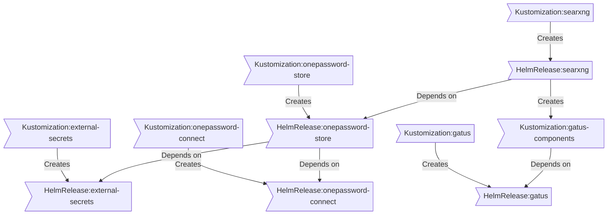

##  Kubernetes

The Kubernetes cluster is deployed using [Talos](https://www.talos.dev), leveraging M.2 NVMe SSDs across all nodes for high-performance storage. The cluster uses OpenEBS-MayaStor as the storage solution, ensuring low-latency, reliable, and efficient block storage for workloads.

### Core Components

- [actions-runner-controller](https://github.com/actions/actions-runner-controller): Self-hosted Github runners, pre-pull images for spegel.
- [cert-manager](https://github.com/cert-manager/cert-manager): Creates SSL certificates for services in my cluster.
- [cilium](https://github.com/cilium/cilium): Internal Kubernetes container networking interface.
- [cloudflared](https://github.com/cloudflare/cloudflared): Enables Cloudflare secure access to certain ingresses.
- [external-dns](https://github.com/kubernetes-sigs/external-dns): Automatically syncs ingress DNS records to a DNS provider.
- [external-secrets](https://github.com/external-secrets/external-secrets): Managed Kubernetes secrets using [1Password Connect](https://github.com/1Password/connect).
- [ingress-nginx](https://github.com/kubernetes/ingress-nginx): Kubernetes ingress controller using NGINX as a reverse proxy and load balancer.
- [openebs-mayastor](https://github.com/openebs/mayastor): Distributed block storage for peristent storage.
- [spegel](https://github.com/spegel-org/spegel): Stateless cluster local OCI registry mirror.
- [volsync](https://github.com/backube/volsync): Backup and recovery of persistent volume claims.

### GitOps

[Flux](https://github.com/fluxcd/flux2) watches the clusters in my [kubernetes](./kubernetes/) folder (see Directories below) and ensures that my clusters are updated based on the state of the corresponding Git repository.

In my setup, Flux operates by recursively scanning the `kubernetes/apps` folder until it identifies the top-level `kustomization.yaml` file within each directory. This file serves as the entry point for Flux, and it lists all the resources to be applied to the cluster. Typically, the `kustomization.yaml` contains a namespace resource and one or more Flux kustomizations (`ks.yaml`). These kustomizations govern the deployment of specific resources, including `HelmRelease` resources or other application-specific resources, which Flux subsequently applies to the cluster.

[Renovate](https://github.com/renovatebot/renovate) continuously monitors my **entire** repository for dependency updates. When an update is detected, Renovate automatically creates a pull request. Upon merging these pull requests, Flux is triggered to apply the changes to my clusters, ensuring that my environments are always aligned with the latest desired state as defined in Git.

This GitOps workflow enables a fully automated and declarative approach to managing both the infrastructure and application deployments across my Kubernetes clusters. By relying on Flux and Renovate, I can ensure that updates are consistent, repeatable, and seamlessly applied, maintaining the integrity and reliability of the cluster without manual intervention.

### Directories

This Git repository contains the following directories under [Kubernetes](./kubernetes/).

```sh
📁 kubernetes
├── 📁 apps           # applications
├── 📁 bootstrap      # bootstrap procedures
├── 📁 components     # re-useable components
├── 📁 flux           # flux system configuration
└── 📁 talos          # talos configuration
```

### Flux Workflow

This is a high-level look how Flux deploys my applications with dependencies. In most cases a `HelmRelease` will depend on other `HelmRelease`'s, in other cases a `Kustomization` will depend on other `Kustomization`'s, and in rare situations an app can depend on a `HelmRelease` and a `Kustomization`. The example below shows that `searxng` won't be deployed or upgrade until the `onepassword-store` Helm release is installed or in a healthy state.


