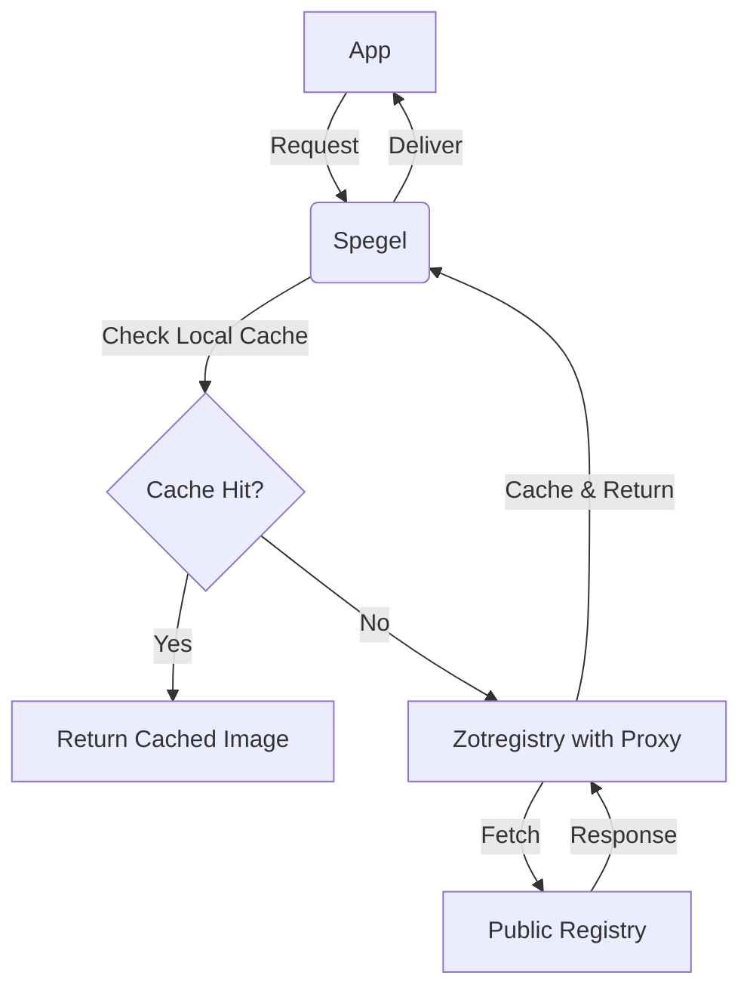

## Proxies

- In my homelab, internet connections, especially to registries, need a corporate proxy;
- However, this HTTP/S based proxy has a negative impact on 'HTTPS POST' and 'QUIC';
- Also, proxies are handled outside the cluster;

### Cloudflared proxied

- using custom image `ghcr.io/alliottech/cloudflared_proxy`, with socks5 proxy;
- proxy config set `dns.fake-ip-filter:"+.argotunnel.com"` and `sniffer.skip-domain:"+.argotunnel.com"`;

### Pull-thorugh mirrors

```yaml
# talconfig.yaml, powered by zotregistry
- |-
  machine:
    registries:
      config:
        zot.noirprime.com:
          auth:
            username: admin
            password: ${ZOT_REGISTRY_PASS}
      mirrors:
        docker.io:
          endpoints:
            - https://zot.noirprime.com/docker.io
          overridePath: true
        ghcr.io:
          endpoints:
            - https://zot.noirprime.com/ghcr.io
          overridePath: true
        gcr.io:
          endpoints:
            - https://zot.noirprime.com/gcr.io
          overridePath: true
        registry.k8s.io:
          endpoints:
            - https://zot.noirprime.com/registry.k8s.io
          overridePath: true
        public.ecr.aws:
          endpoints:
            - https://zot.noirprime.com/public.ecr.aws
          overridePath: true
```


