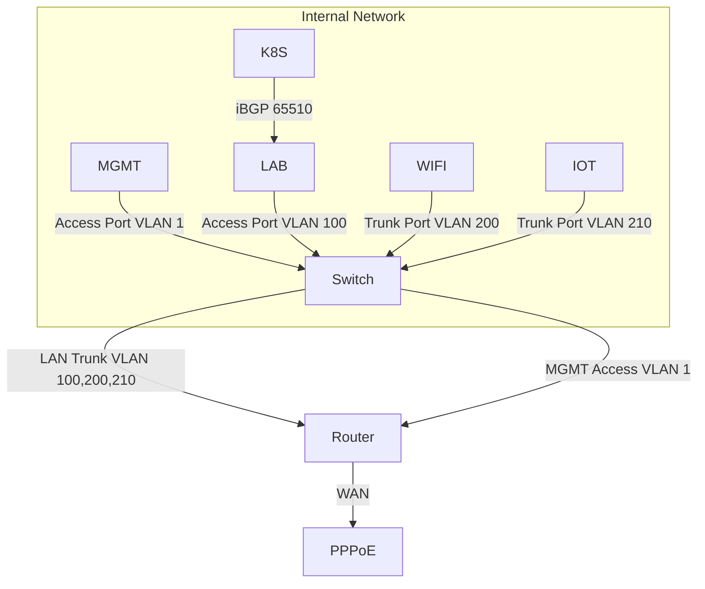

## Service Topology

### Components

- Router / Firewall / DHCP / DNS / NTP / TProxy : `OpenWRT`;
- NAS / Infrastructure Services : `QNAP Qu805`;
- Gateway / DHCP Relay / iBGP / OSPF: `H3C L3 Core Switch`;
- Computing / Other Services : `Talos MS-01`;

### Notes

- All LACP devices using `layer 3+4` for better compatibility;
- Enable jumbo frame for `K8S`, `NAS`, `Router`;
