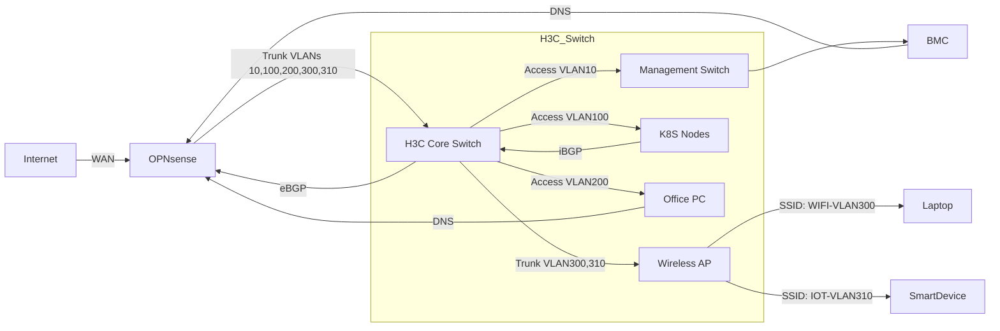

## Service Topology

```mermaid
graph LR
  Internet[Internet] -->|WAN| OPNsense
  OPNsense -->|Trunk VLANs 10,100,200,300,310| H3C[H3C Core Switch]

  subgraph H3C_Switch
	H3C -->|Access VLAN10| MGMT[Management Switch]
    H3C -->|Access VLAN100| LAB[K8S Nodes]
    H3C -->|Access VLAN200| LAN[Office PC]
    H3C -->|Trunk VLAN300,310| AP[Wireless AP]
  end

  AP -->|SSID: WIFI-VLAN300| Laptop
  AP -->|SSID: IOT-VLAN310| SmartDevice
  MGMT --> BMC
  BMC -->|DNS| OPNsense
  LAN -->|DNS| OPNsense
  LAB -->|iBGP| H3C
  H3C -->|eBGP| OPNsense
```
