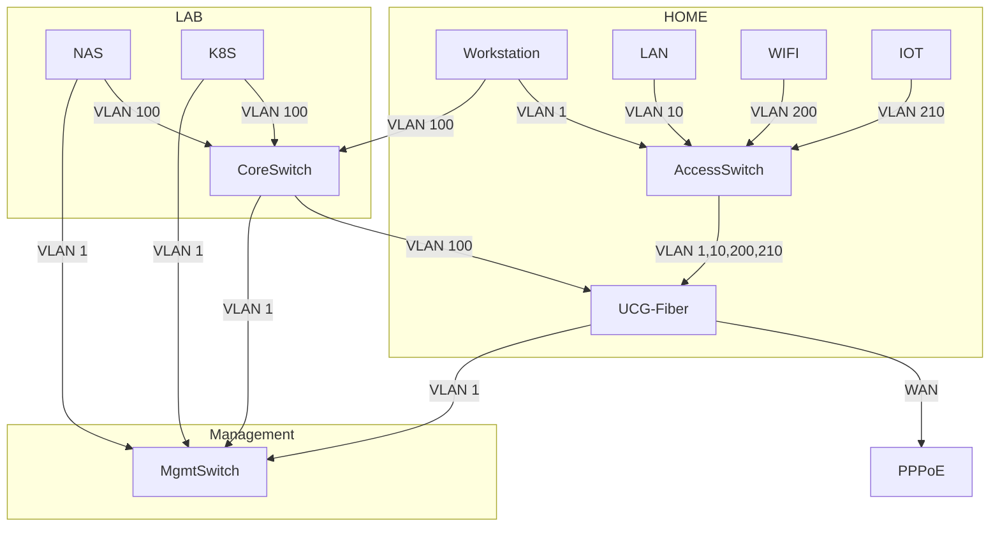

## Service Topology

### Components

- Router / Firewall / DHCP / NTP : `UCG-Fiber`;
- DNS / TProxy : `OpenWRT@Synology`;
- NAS / Infrastructure Services : `Synology DS1825+`;
- EBGP / OSPF : `H3C S6520-24S-SI`;
- Computing : `MS-01`;

### Notes

- All LACP devices using `layer 3+4` for better compatibility;
- Enable jumbo frame for `K8S`, `NAS`, `Router`;
